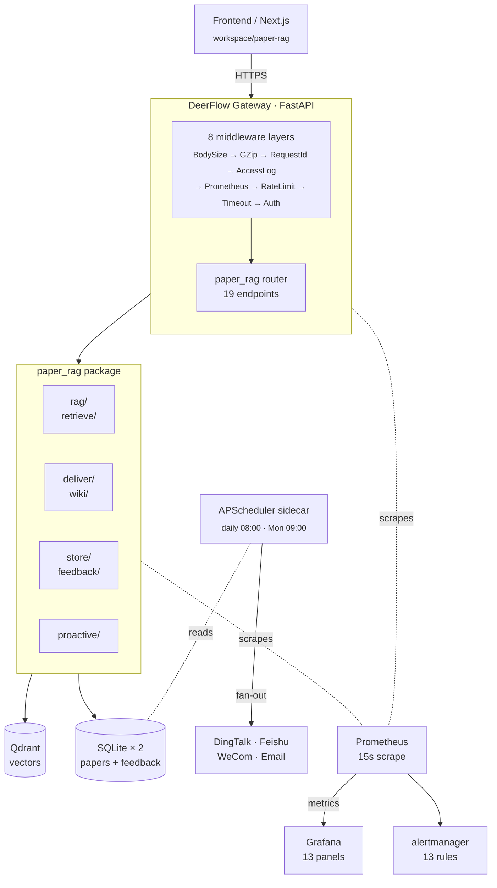
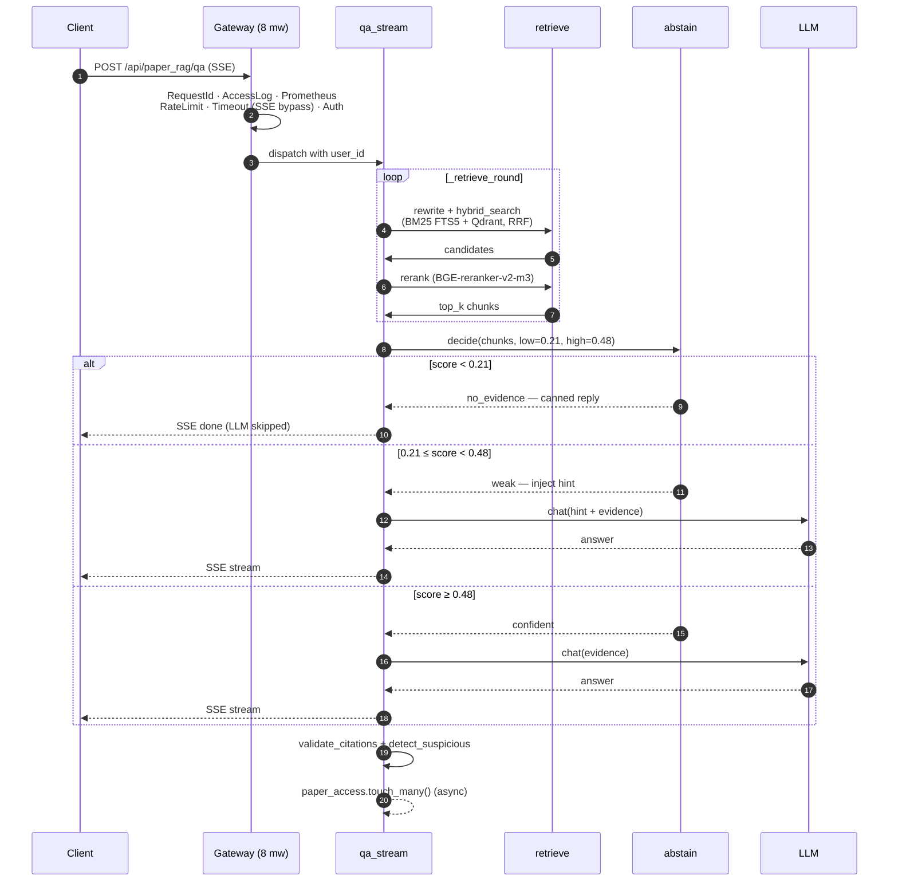

# paper_rag

[](https://github.com/TongTong0828/paper-rag-agent/actions)
[](https://codecov.io/gh/TongTong0828/paper-rag-agent)
[]()
[](LICENSE)

Agentic RAG over academic papers. Originally built as a sub-system for
[DeerFlow](https://github.com/bytedance/deer-flow); the code in this repo runs
standalone as a Python package + FastAPI router.

What's inside:

- Hybrid retrieval (BM25 + dense Qdrant, RRF fusion, BGE reranker)
- Three-tier abstain decision (`confident / weak_evidence / no_evidence`) with
  data-driven threshold calibration
- Self-evolving wiki with cross-paper concept linking
- Five deliverable formats: markdown survey / pptx / docx / latex+bib / pdf
- Proactive scheduler: daily digest, subscription matching, stale-paper
  reminders, auto-ingest webhook
- Feedback loop: thumbs / copy events → hard-case dataset → semi-auto
  threshold recalibration

Numbers (HEAD of `main`):

| | |
|---|---|
| Tests | 162 passing (incl. 19 middleware) |
| ADRs | 21 |
| HTTP endpoints | 19 |
| Grafana panels / alert rules | 13 / 13 |

---

## Quickstart

```bash
# 1. Install runtime dependencies.
# For the full DeerFlow + real QA path, use the embedded backend venv.
python -m pip install -e ".[dev,embed,ingest]"
make init-store

# 2. Ingest a paper and ask a question (CLI)
make ingest ID=2310.11511                 # Self-RAG
make ask Q="What is Self-RAG?"

# 3. Run the embedded DeerFlow gateway + workspace UI
cp .env.example .env                      # then put real provider values in .env
make deerflow-backend
make deerflow-frontend                    # second terminal, opens /workspace/paper-rag

# 4. Regression checks
make verify-p0                            # lint + focused tests + smoke + secret scan + golden retrieval
make eval-golden-qa                       # real QA no-judge golden set, requires LLM credentials
```

CI installs only the minimal dependency set required for pure-logic tests
and the import-walk smoke check; see `.github/workflows/ci.yml` if you want
to reproduce that environment locally.

For DeepSeek or another OpenAI-compatible provider, keep credentials in local
`.env` only:

```bash
OPENAI_BASE_URL=https://api.deepseek.com
OPENAI_API_KEY=sk-...
CHAT_MODEL=deepseek-chat
PAPER_RAG_CONFIG=config/local.yaml
```

`.env` and runtime indexes are gitignored. Run `make secret-scan` before
publishing or sharing a branch.

---

## Architecture



The gateway and middleware live in the deer-flow monorepo. A snapshot of
those files (router + middleware + frontend page + observability stack)
is reproduced under [`docs/integration/`](docs/integration/) for reference.

---

## Request flow (typical QA)



See [`docs/diagrams/abstain_flow.md`](docs/diagrams/abstain_flow.md) for the
full mermaid sequence diagram and [`docs/SYSTEM_DESIGN.md`](docs/SYSTEM_DESIGN.md)
for a longer walkthrough. [`docs/DEMO.md`](docs/DEMO.md) has 4 mermaid
diagrams for the abstain decision, proactive scheduler, feedback loop,
and middleware stack. Runnable walk-throughs live in [`examples/`](examples/).

---

## Current Golden Baseline

The strict regression set is [`tests/eval/qa_set.golden.jsonl`](tests/eval/qa_set.golden.jsonl).
It contains evidence-supported questions plus explicit no-answer cases. The
latest no-judge QA run is saved under `data/index/eval_runs/` locally.

| Metric | Latest local value |
|---|---:|
| Positive paper recall@10 | 1.0 |
| Positive paper MRR | 0.947 |
| Citation existence | 1.0 |
| Must-contain coverage | 1.0 |
| No-answer success | 1.0 |
| No-answer direct abstain | 1.0 |

Useful commands:

```bash
make eval-golden       # retrieval-only, no LLM generation
make eval-golden-qa    # real QA, no LLM judge
```

## Performance baseline

Numbers from `docs/PERF_BASELINE.md`; production traffic will refresh them.

| Metric | Value | Notes |
|---|---|---|
| Test suite | 3.0 s | 162 tests, used as CI gate |
| Recall@10 | 0.90 | 33-question eval set |
| Abstain neg-blocked / pos-kept | 100% / 97% | offline calibration |
| QA P50 / P95 | ~2.0s / ~5.0s | confident path / reflect+long answer |
| `no_evidence` latency | ~250 ms | LLM is skipped |
| Cold start (qa_agentic) | 316 ms | OpenAI client + tiktoken |
| Lean docker image | ~600 MB | multi-stage + venv copy |

---

## Failure modes

| Component down | Effect | Degradation |
|---|---|---|
| Qdrant | Dense recall is empty | BM25-only path; abstain switches to BM25 score |
| LLM | Generation fails | Evidence-only response, `qa_degraded_total` increments |
| Reranker | Rerank fails | Falls back to RRF order, marks `quality=low` |
| feedback.sqlite locked | Inbox writes drop | Logs warning; QA path unaffected |
| All webhooks | No outbound push | Inbox still readable from frontend |
| Cron container | Digest / stale skip | Gateway unaffected; manual `POST /proactive/digest/run` |
| Redis (rate limit) | Multi-replica counters drift | Falls back to in-memory window |

13 Prometheus alert rules cover 5xx > 1%, p95 > 5s, abstain rate > 30%,
auth/timeout/rate spikes, and component-down conditions.

---

## Key design decisions

| ADR | Topic |
|---|---|
| 0014 | Three-tier abstain — calibration vs recall trade-off |
| 0015 | M8 service split: sibling package + gateway router |
| 0016 | N+1+S call shape for survey generation |
| 0017 | M11 feedback loop — semi-auto threshold recalibration |
| 0018 | M9 proactive agent + APScheduler |
| 0019 | Two SQLite databases (papers vs feedback) |
| 0020 | 8-layer middleware stack + Prometheus cardinality control |
| 0021 | Four langgraph middlewares (cost / latency / recursion / PII) |

Full set: [`docs/adrs/`](docs/adrs/).

---

## Repository layout

```
paper_rag/
├── src/paper_rag/
│   ├── rag/                  Core agentic loop
│   │   ├── abstain.py        Three-tier decision (ADR-0014)
│   │   ├── qa_agentic.py     Rewrite → retrieve → rerank → reflect
│   │   └── qa_stream.py      SSE variant
│   ├── retrieve/             Hybrid + rerank
│   ├── deliver/              5 deliverable formats
│   ├── proactive/            Daily digest, subscriptions, stale, webhook
│   ├── feedback/             Event store + hard-case extraction
│   └── observability/        60-line stdlib Prometheus exposition
├── tests/                    pytest 162/162
├── scripts/
│   ├── calibrate_abstain.py  Online / offline threshold calibration
│   └── collect_hard_cases.py Weekly cron entry
└── docs/
    ├── SYSTEM_DESIGN.md
    ├── PERF_BASELINE.md
    ├── EVAL_REPORT.md
    ├── adrs/                 21 ADRs
    ├── diagrams/             3 mermaid sequence diagrams
    └── integration/          Snapshot of deer-flow integration files
```

---

## Development

```bash
# Install dev tooling
pip install -e .[dev]
pre-commit install                  # local lint matches CI

# Lint (same rules CI runs)
ruff check --select E,F,W,I --ignore E501 src tests

# Tests (real pytest, with coverage)
pytest -q \
    --ignore=tests/eval \
    --ignore=tests/test_gateway_paper_rag.py \
    --ignore=tests/test_middleware.py \
    --ignore=tests/test_langgraph_middleware.py \
    --cov=src/paper_rag

# Lightweight fallback for environments without pytest
PYTHONPATH=src:tests python scripts/_run_tests.py
PYTHONPATH=src python scripts/_run_smoke.py

# Threshold calibration
python scripts/calibrate_abstain.py --mode offline
python scripts/calibrate_abstain.py --mode online --no-rewrite --top-k 8

# Collect hard cases (weekly)
make hard-cases
```

Contributions and bug reports are welcome — see [CONTRIBUTING.md](CONTRIBUTING.md).

---

## License

MIT — see [LICENSE](LICENSE).
