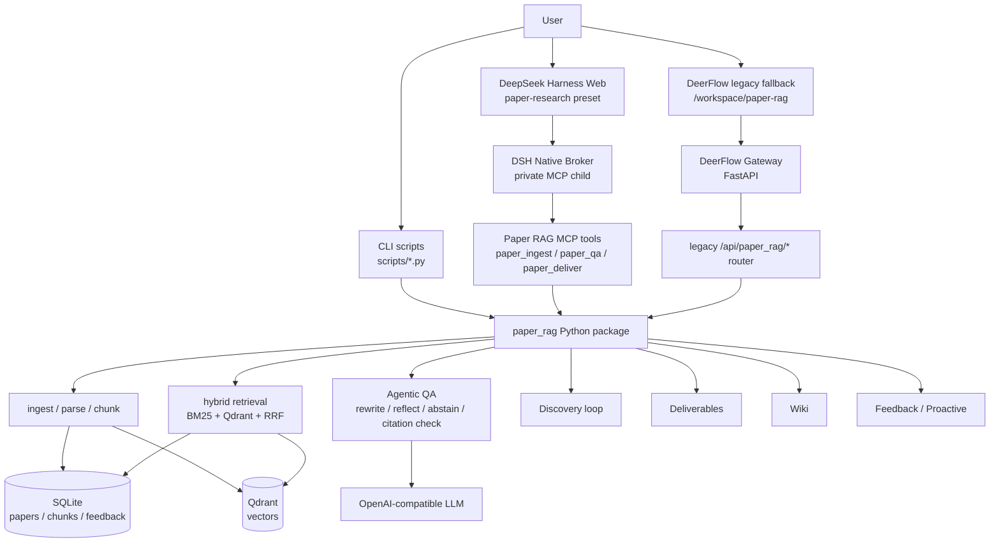

# Paper RAG Agent

[English](README_EN.md) | 中文

[](https://github.com/Ttttt-s/paper-rag-agent/actions)
[](https://codecov.io/gh/Ttttt-s/paper-rag-agent)
[](https://www.python.org/)
[](LICENSE)

Paper RAG Agent 是一个面向学术论文的本地 RAG / Agentic RAG 项目。它可以把 arXiv、PDF URL 或本地 PDF 入库，解析论文，切分 chunk，建立 SQLite + Qdrant 混合索引，然后用带引用约束的 Agentic QA 回答论文问题。默认交互入口是 DeepSeek Harness 的 `paper-research` 预设；仓库仍保留 DeerFlow 工作区作为 legacy fallback，方便 G5 前回滚和对照验证。

这个仓库现在有三种使用方式：

| 模式 | 适合谁 | 入口 |
|---|---|---|
| DeepSeek Harness 本地应用 | 想直接打开默认论文研究 UI | `make dsh-start`、`integrations/deepseek-harness/` |
| Standalone Python 包 | 想在命令行或自己的服务里调用论文 RAG | `src/paper_rag/`、`scripts/` |
| DeerFlow legacy fallback | G5 前需要回滚或对照旧宿主 | `integrations/deer-flow/`、`make deerflow-*` |

本地体验是当前重点。生产部署、云上权限、备份恢复、成本核算和多租户隔离已有部分工程基础，但默认 README 以本地可跑通为主。

## 功能总览

| 能力 | 说明 |
|---|---|
| 论文入库 | 支持 arXiv ID、PDF URL、本地 PDF；可选择 PyMuPDF fallback 或 MinerU 解析 |
| 图表多模态摘要 | 可选用 OpenAI-compatible 视觉 API 总结 MinerU 提取的 figure/table，并把摘要随上下文一起入库；API 失败时可懒加载本地 Qwen2.5-VL fallback |
| 混合检索 | SQLite 元数据、FTS5/BM25 稀疏检索、Qdrant dense vector、RRF 融合、可选 BGE reranker |
| Agentic QA | query rewrite、HyDE、反思式检索、证据选择、引用校验、no-evidence 拒答 |
| Trace 与可审计性 | QA 返回 intent、rewrite、retrieval rounds、selected evidence、abstain 决策和 citations，方便定位从检索到答案的问题 |
| 引用约束 | 回答必须基于检索 chunk，使用 `[chunk:<id>]` 形式，避免伪造 `[1]`、作者年份引用 |
| Paper Discovery | 按研究主题发现候选论文，返回候选分数、选中/跳过原因；候选必须入库后才能成为最终证据 |
| DeepSeek Harness UI | 默认 `paper-research` 预设提供 QA、Discovery、Knowledge Builder、Wiki、Feedback、Inbox、Subscriptions |
| Research Memory | 多轮研究对话压缩记忆，只作为上下文，不作为最终证据 |
| Wiki 自演化 | 对已入库论文生成概念笔记、相关概念和开放问题，默认关闭，可配置开启 |
| 交付物生成 | 支持 Markdown survey、PPTX、DOCX、LaTeX/BibTeX、PDF |
| Feedback 闭环 | 记录 thumbs/copy 等反馈，沉淀 hard cases，支撑后续评测和阈值校准 |
| Proactive Agent | 订阅、inbox、digest、stale paper 提醒、auto-ingest hook |
| MCP 工具 | `paper_ingest`、`paper_qa`、`paper_search`、`paper_section`、`paper_compare`、`paper_discover`、`wiki_lookup`、`export_bibtex`、`paper_deliver` |
| DeerFlow fallback | `/workspace/paper-rag` 和旧 Harness tools 保留到 G5，用于回滚和对照验证 |
| RAG / Agent 评测 | retrieval golden、QA no-judge、citation audit、claim eval、ablation、LLM recall、MCP/DSH/legacy 回归，覆盖从召回到 Agent 工具答复 |
| 安全与用户边界 | DSH Native Broker + 私有 MCP 维持本地用户边界；DeerFlow fallback 的 auth/user_id 测试继续保留到 G5 |
| 观测与运维 | DSH smoke、Gateway metrics、Prometheus、Grafana dashboard、secret scan |

## 架构



### Discovery 与 QA 的边界

Discovery 只负责找候选论文。候选论文的摘要、标题、外部 metadata 不能直接作为最终回答证据。只有论文完成入库、解析、切块、embedding、索引，并被 QA loop 检索出来之后，才能出现在最终回答引用里。

## 环境要求

| 组件 | 推荐版本 | 说明 |
|---|---|---|
| Python | 3.10+；DeerFlow fallback 建议 3.12 | 核心包和 migration-owned gate 不依赖 DeerFlow venv |
| Node.js | 20+ | DeepSeek Harness 使用 pnpm / Corepack |
| uv | 最新稳定版 | 仅在启动 DeerFlow fallback backend 时需要 |
| Docker | 可选 | 仅在使用 Qdrant server、proactive sidecar、观测栈时需要 |
| LLM Key | OpenAI-compatible | DeepSeek、OpenAI、DashScope/Qwen 等兼容接口都可 |

默认本地配置 `config/local.yaml` 使用 embedded Qdrant：

```yaml
qdrant:
  url: ""
  local_path: ./data/index/qdrant_embedded
```

因此最小本地 demo 不强制启动 Docker Qdrant。

## 快速开始：DeepSeek Harness UI

### 1. 克隆项目

```bash
git clone https://github.com/Ttttt-s/paper-rag-agent.git
cd paper-rag-agent
```

### 2. 准备 Paper RAG Python 环境

```bash
python3 -m venv .venv
source .venv/bin/activate
export PY="$PWD/.venv/bin/python"
$PY -m pip install -U pip
$PY -m pip install -e ".[dev,embed,ingest,deliver,deliver-pdf,proactive]"
```

如果只想跑轻量测试，可以不装 `embed`；如果要真实入库和 QA，建议按上面的 extras 安装。

### 3. 安装 DeepSeek Harness 依赖

```bash
make dsh-install
```

### 4. 配置 LLM

```bash
cp .env.example .env
```

编辑 `.env`，填入自己的 OpenAI-compatible provider：

```bash
OPENAI_BASE_URL=https://api.deepseek.com
OPENAI_API_KEY=sk-your-key-here
CHAT_MODEL=deepseek-v4-flash
SMALL_MODEL=deepseek-v4-flash
PAPER_RAG_CONFIG=config/local.yaml
```

真实 key 只放在本地 `.env` 或 shell 环境中，不要提交到 git。

可选：如果希望 ingest 时把 MinerU 提取出的图表用多模态模型总结后再入库，打开 `config/local.yaml` 中的 `vision.enabled`，并配置 OpenAI-compatible 视觉模型：

```bash
VISION_BASE_URL=https://your-vision-provider.example/v1
VISION_API_KEY=sk-your-vision-key
VISION_MODEL=qwen-vl-plus
```

本地 fallback 是懒加载的 Qwen2.5-VL 适配器；只有设置 `vision.fallback_local: true` 且安装本地依赖时才会尝试：

```bash
$PY -m pip install -e ".[vision-local]"
```

### 5. 初始化索引并入库一篇论文

```bash
$PY scripts/init_store.py
$PY scripts/ingest_one.py --arxiv 2310.11511
```

也可以用本地 PDF：

```bash
$PY scripts/ingest_one.py --pdf /absolute/path/to/paper.pdf --title "My Paper"
```

### 6. 启动后端和前端

```bash
make dsh-doctor
make dsh-start
```

打开：

```text
http://127.0.0.1:3080
```

可以尝试：

- Ask：`What is Self-RAG?`
- Discovery Loop：搜索 `agentic rag loop engineering`，查看候选和原因，再入库选中的论文
- Loop Trace：查看 intent、rewrite、retrieval rounds、abstain、citations
- Knowledge Builder：查看论文从 fetch 到 wiki 的构建状态
- Wiki：生成或查看论文概念笔记
- Feedback：对回答点 helpful / not helpful
- Subscriptions：新增、暂停、恢复、删除主题订阅
- Deliver：生成 Markdown survey、PPT、Word、LaTeX/BibTeX 或 PDF

## DeerFlow legacy fallback

G5 删除前，DeerFlow 仍保留为 legacy fallback。需要回滚或对照旧宿主时，可启动：

```bash
make deerflow-backend
make deerflow-frontend
```

然后打开 `http://127.0.0.1:3000/workspace/paper-rag`。DeerFlow 路径不再是默认入口，新功能优先接入 DeepSeek Harness + MCP。

## 命令行用法

如果不启动 DeerFlow UI，也可以直接使用 Python 包和脚本。

```bash
python3 -m venv .venv
source .venv/bin/activate
python -m pip install -U pip
python -m pip install -e ".[dev,ingest,embed,deliver,deliver-pdf,deerflow]"
```

初始化：

```bash
python scripts/init_store.py
python scripts/ingest_one.py --arxiv 2310.11511
```

问答：

```bash
python scripts/ask.py "What is Self-RAG?"
python scripts/ask.py "What is the main contribution?" --paper-id arxiv:2310.11511
python scripts/ask.py "What is Self-RAG?" --no-llm --top-k 8
```

批量入库：

```bash
cat > ids.txt <<EOF
arxiv:2310.11511
url:https://example.com/paper.pdf
EOF

python scripts/ingest_batch.py --file ids.txt
```

## DeerFlow Agent 工具

Paper RAG 已注册为 DeerFlow Harness tools，并由内置 `paper-research` subagent 使用。

| Tool | 作用 |
|---|---|
| `paper_ingest` | 入库 arXiv ID、PDF URL 或本地 PDF |
| `paper_qa` | 对已索引论文进行证据约束 QA |
| `paper_search` | 在本地论文库中搜索相关论文 |
| `paper_section` | 读取某篇论文的指定章节 |
| `paper_compare` | 按多个维度比较多篇论文 |
| `paper_discover` | 按主题发现候选论文 |
| `wiki_lookup` | 查询自演化 wiki 概念笔记 |
| `export_bibtex` | 导出 BibTeX |
| `paper_deliver` | 生成 Markdown / PPTX / DOCX / LaTeX+BIB / PDF |

对应文件：

```text
integrations/deer-flow/backend/packages/harness/deerflow/community/paper_rag/tools.py
integrations/deer-flow/backend/packages/harness/deerflow/subagents/builtins/paper_research.py
integrations/deer-flow/skills/public/paper-research/SKILL.md
```

## HTTP API

DeerFlow gateway 暴露 `/api/paper_rag/*`。常用端点如下：

| Method | Path | 说明 |
|---|---|---|
| GET | `/api/paper_rag/status` | 运行时状态：LLM、embedding、Qdrant、索引数量 |
| POST | `/api/paper_rag/qa` | SSE 流式 QA |
| POST | `/api/paper_rag/qa/sync` | 同步 QA |
| GET | `/api/paper_rag/papers` | 当前用户论文列表 |
| POST | `/api/paper_rag/papers/ingest` | 入库 arXiv / PDF |
| GET | `/api/paper_rag/knowledge/builds` | Knowledge Builder 状态 |
| POST | `/api/paper_rag/discovery/run` | 运行论文发现 |
| GET | `/api/paper_rag/discovery/runs` | 发现任务列表 |
| GET | `/api/paper_rag/discovery/runs/{run_id}` | 发现任务详情 |
| POST | `/api/paper_rag/discovery/candidates/{candidate_id}/ingest` | 入库发现候选 |
| GET | `/api/paper_rag/wiki/{paper_id}` | 查询 wiki |
| POST | `/api/paper_rag/wiki/{paper_id}/generate` | 生成 wiki |
| POST | `/api/paper_rag/deliver` | 生成交付物 |
| POST | `/api/paper_rag/feedback` | 写入反馈 |
| GET | `/api/paper_rag/feedback/recent` | 最近反馈 |
| GET | `/api/paper_rag/feedback/stats` | 反馈统计 |
| GET | `/api/paper_rag/subscriptions` | 订阅列表 |
| POST | `/api/paper_rag/subscriptions` | 新增订阅 |
| PATCH | `/api/paper_rag/subscriptions/{sub_id}` | 启用/禁用订阅 |
| DELETE | `/api/paper_rag/subscriptions/{sub_id}` | 删除订阅 |
| GET | `/api/paper_rag/inbox` | inbox 列表 |
| GET | `/api/paper_rag/inbox/stream` | inbox SSE |
| POST | `/api/paper_rag/inbox/{item_id}/read` | 标记已读 |
| POST | `/api/paper_rag/inbox/{item_id}/dismiss` | 关闭通知 |
| POST | `/api/paper_rag/proactive/digest/run` | 手动触发 digest |
| POST | `/api/paper_rag/proactive/stale/run` | 手动触发 stale scan |

本地 `make deerflow-backend` 默认设置 `DEER_FLOW_AUTH_DISABLED=1`，方便 demo。生产或对外服务不要这样启动，应启用 DeerFlow auth 配置和 session 中间件。

## 交付物生成

支持格式定义在 `src/paper_rag/deliver/dispatch.py`：

```text
markdown_survey
pptx
docx
latex_bib
pdf
```

Python 示例：

```python
from paper_rag.deliver import dispatch

result = dispatch(
    "markdown_survey",
    ["arxiv:2310.11511"],
    title="Self-RAG Reading Notes",
)

print(result.filename)
print(result.content_type)
```

Agent / DeerFlow 中使用 `paper_deliver`。

## 评测与质量门禁

这个项目的评测不是只看向量 top-k，而是分层覆盖“召回 -> 证据选择 -> 引用 -> 拒答 -> 语义 claim -> DeerFlow 工具调用 -> Gateway API”。如果检索本身没有找到证据，后面的 Agent 答复再流畅也不算通过。

| 层级 | 评测重点 | 命令 / 文件 | 核心指标或断言 |
|---|---|---|---|
| Retrieval 层 | 问题能不能召回正确 paper / chunk | `make eval-golden`、`tests/eval/qa_set.golden.jsonl` | `positive_paper_recall@10`、`positive_chunk_recall@10`、MRR、nDCG、FPR |
| RAG 生成层 | 答案是否只引用 selected evidence，no-evidence 时是否拒答 | `make eval-golden-qa`、`make eval-citation-audit` | `cite_existence`、`cite_precision`、`cite_recall`、`must_contain`、`no_answer_success_rate` |
| Claim 语义层 | 最终答复是否覆盖关键结论，且这些结论有 citation 支撑 | `make eval-claims`、`make eval-claims-report` | `claim_recall`、`grounded_claim_recall`、`forbidden_claim_violations` |
| 策略对比层 | dense / sparse / hybrid / rerank / rewrite / HyDE 是否真的提升召回 | `make eval-ablation`、`make eval-llm-recall` | `rewrite_gain_count`、`rewrite_harm_rate`、latency |
| Agent 工具层 | DeerFlow lead agent / `paper-research` subagent 是否能调用论文工具，payload 是否保持可审计 | `make deerflow-paper-rag-test`、`integrations/deer-flow/backend/tests/test_paper_rag_harness_adapter.py` | tool 注册、subagent 注册、`paper_ingest` / `paper_discover` / `paper_deliver` 调用契约 |
| Gateway 产品层 | UI/API 入口是否覆盖 QA、ingest、discovery、wiki、feedback、proactive，并正确处理认证和 user scope | `make deerflow-smoke`、`integrations/deer-flow/backend/tests/test_paper_rag_integration.py` | route readiness、auth required、secret redaction、user_id propagation |
| 运维门禁 | 基础代码质量、导入、密钥泄漏、smoke | `make verify-p0`、`scripts/_run_smoke.py`、`scripts/secret_scan.py` | lint/test/smoke/secret scan/errors |

几个边界需要特别注意：

- Discovery、Wiki、Research Memory 只能提供研究上下文，不能直接作为最终答案证据。
- 最终 QA 评测只认本轮 indexed chunks、selected evidence 和 `[chunk:<id>]` citations。
- Agent 层评测的重点不是 LLM 文风，而是 DeerFlow 工具契约、证据边界、错误返回和可审计 trace 是否稳定。

常用命令：

```bash
make verify-p0
make eval-golden
make eval-golden-qa
make eval-report
make eval-citation-audit
make eval-ablation
make eval-claims
make eval-claims-report
make eval-llm-recall
make deerflow-smoke
make deerflow-paper-rag-test
```

| 命令 | 作用 |
|---|---|
| `make verify-p0` | lint、focused tests、smoke、secret scan、golden retrieval |
| `make eval-golden` | retrieval-only strict golden set |
| `make eval-golden-qa` | full QA no-judge golden set |
| `make eval-citation-audit` | 生成 citation audit 报告 |
| `make eval-ablation` | 对比 dense、sparse、hybrid、rerank、rewrite |
| `make eval-claims` | claim-level QA gate |
| `make eval-llm-recall` | 对比 no/local/LLM rewrite 的 recall |
| `make deerflow-smoke` | 对正在运行的 DeerFlow gateway 做 Paper RAG endpoint smoke |
| `make deerflow-paper-rag-test` | 跑 DeerFlow backend 的 Paper RAG gateway 集成测试 |
| `make secret-scan` | 扫描可能误提交的 API key |

评测数据：

```text
tests/eval/README.md
tests/eval/qa_set.golden.jsonl
tests/eval/qa_set.real.jsonl
tests/eval/qa_set.claims.jsonl
```

最近维护时使用过的快速验证组合：

```bash
.venv/bin/ruff check --select E,F,W,I --ignore E501 src tests
PYTHONPATH=src .venv/bin/python scripts/_run_smoke.py
PYTHONPATH=src:tests .venv/bin/python -m pytest -q --ignore=tests/eval --ignore=tests/test_gateway_paper_rag.py --ignore=tests/test_middleware.py --ignore=tests/test_langgraph_middleware.py
PYTHONPATH=integrations/deer-flow/backend:integrations/deer-flow/backend/packages/harness:src .venv/bin/python -m pytest -q integrations/deer-flow/backend/tests/test_paper_rag_integration.py
PYTHONPATH=src:integrations/deer-flow/backend/packages/harness .venv/bin/python -m pytest -q integrations/deer-flow/backend/tests/test_paper_rag_harness_adapter.py
```

## Docker 与观测

根目录 `Dockerfile` 是可选的 standalone paper_rag 镜像，适合跑 CLI、预热 embedding 模型或 proactive cron：

```bash
make docker-build
docker build -t paper-rag:full --build-arg EXTRAS=deliver,deerflow,proactive .
```

预热 BGE-M3 模型：

```bash
make docker-build-bake
```

以 proactive cron 模式运行 standalone 容器：

```bash
docker run --rm \
  -v "$PWD/data:/opt/paper_rag/data" \
  -v "$PWD/config:/opt/paper_rag/config:ro" \
  --env-file .env \
  -e PAPER_RAG_CONFIG=/opt/paper_rag/config/local.yaml \
  -e PAPER_RAG_MODE=proactive \
  paper-rag:full proactive
```

DeerFlow 自身的生产 compose 位于 `integrations/deer-flow/docker/`：

```bash
cd integrations/deer-flow/docker
docker compose -f docker-compose.yaml up -d
```

Prometheus / Grafana 配置位于 `docs/integration/observability/`。如果已经启动上面的 DeerFlow compose，可以从 `docs/integration` 目录启动观测栈：

```bash
cd docs/integration
docker compose -f observability/docker-compose.observability.yaml up -d
```

默认观测地址：

```text
Prometheus: http://localhost:9090
Grafana:    http://localhost:3001  admin/admin
```

## 配置文件

| 文件 | 说明 |
|---|---|
| `.env.example` | 本地环境变量模板 |
| `config/local.yaml` | 本地 demo 推荐配置，embedded Qdrant |
| `config/default.yaml` | Python 包默认配置 |
| `config/production.yaml` | 生产式配置示例，适合远端 Qdrant |
| `config/magic-pdf.json` | MinerU / magic-pdf 配置 |

关键环境变量：

| 变量 | 说明 |
|---|---|
| `PAPER_RAG_CONFIG` | 配置文件路径，默认常用 `config/local.yaml` |
| `PAPER_RAG_HOME` | DeerFlow 查找 paper_rag 包时使用 |
| `OPENAI_BASE_URL` | OpenAI-compatible endpoint |
| `OPENAI_API_KEY` | LLM provider key |
| `CHAT_MODEL` | 回答用模型 |
| `SMALL_MODEL` | 小模型，当前多处复用 chat model 即可 |
| `VISION_BASE_URL` | 可选视觉模型 OpenAI-compatible endpoint，用于图表摘要入库 |
| `VISION_API_KEY` | 可选视觉模型 key |
| `VISION_MODEL` | 可选视觉模型名，例如 `qwen-vl-plus` |
| `DEER_FLOW_AUTH_DISABLED` | 本地 demo 可设 `1`；生产不要关闭 auth |

运行时数据默认不提交：

```text
.env
data/
.deer-flow/
integrations/deer-flow/**/.venv
integrations/deer-flow/frontend/.next
integrations/deer-flow/frontend/node_modules
integrations/deer-flow/frontend/public/demo/threads/*/user-data/
```

## 目录结构

```text
paper-rag-agent/
|-- src/paper_rag/                         # Standalone Python package
|   |-- ingest/                            # arXiv / URL / local PDF source
|   |-- parse/                             # PyMuPDF / MinerU parsing
|   |-- chunk/                             # text and multimodal chunk builder
|   |-- embed/                             # bge-m3 embedding
|   |-- store/                             # SQLite + Qdrant stores
|   |-- retrieve/                          # dense/sparse/hybrid retrieval
|   |-- rag/                               # Agentic QA, abstain, memory, streaming
|   |-- discovery/                         # Paper Discovery Loop
|   |-- wiki/                              # self-evolving wiki
|   |-- deliver/                           # markdown/pptx/docx/latex/pdf
|   |-- feedback/                          # feedback events and hard cases
|   |-- proactive/                         # subscriptions, inbox, digest, stale
|   |-- vision/                            # visual summaries for figure/table chunks
|   `-- tools/                             # LLM-agent-facing tool facades
|-- integrations/deer-flow/                # Runnable DeerFlow app
|   |-- backend/app/gateway/routers/       # paper_rag API router
|   |-- backend/packages/harness/deerflow/ # harness tools and subagents
|   |-- docker/                            # DeerFlow compose files
|   |-- frontend/src/app/workspace/paper-rag/
|   `-- skills/public/paper-research/
|-- scripts/                               # ingest, eval, smoke, operations
|-- tests/                                 # unit/integration/eval tests
|-- tests/eval/                            # golden/real/claims eval sets
|-- course/                                # course and interview material
|-- docs/                                  # architecture, ADR, operations, reports
|-- config/                                # local/default/production configs
|-- Dockerfile                             # optional standalone paper_rag image
`-- docker-entrypoint.sh                   # standalone container entrypoint
```

## 课程与面试材料

| 文件 | 内容 |
|---|---|
| [course/README.md](course/README.md) | 课程材料入口 |
| [course/student_quickstart.md](course/student_quickstart.md) | 学生从 clone 到 demo 的 runbook |
| [course/demo_pack.md](course/demo_pack.md) | 固定 demo 论文、问题和演示脚本 |
| [course/troubleshooting_faq.md](course/troubleshooting_faq.md) | 常见问题 |
| [course/paper_rag_agent_project_manual.md](course/paper_rag_agent_project_manual.md) | 中文项目手册 |
| [docs/INTERVIEW_NOTES.md](docs/INTERVIEW_NOTES.md) | 面试速查 |

## 常见问题

| 症状 | 常见原因 | 处理 |
|---|---|---|
| `integrations/deer-flow/backend/.venv/bin/python: no such file` | DeerFlow backend venv 未创建 | `cd integrations/deer-flow/backend && uv sync --python 3.12` |
| `pnpm` 不存在 | Corepack 未启用 | `corepack enable` |
| QA 报 LLM unavailable | `.env` 未配置或 provider 不通 | 检查 `OPENAI_BASE_URL`、`OPENAI_API_KEY`、`CHAT_MODEL` |
| `/api/paper_rag/status` 显示 `embed-missing` | 未安装 embedding extra | `$PY -m pip install -e ".[embed,ingest]"` |
| dense 检索返回 0 | 索引未建或 Qdrant collection 缺失 | `$PY scripts/init_store.py`，必要时 `make deerflow-rebuild-index` |
| 第一次入库或 QA 很慢 | 模型首次下载 | 等待 BGE / reranker 模型缓存完成 |
| MinerU 不可用 | 未安装 `magic-pdf` 或模型未下载 | 先用 PyMuPDF fallback，或看 [docs/MINERU_SETUP.md](docs/MINERU_SETUP.md) |
| 图表没有视觉摘要 | `vision.enabled` 默认关闭，或 `VISION_*` 未配置 | 在配置里启用 `vision.enabled` 并设置 `VISION_BASE_URL`、`VISION_API_KEY`、`VISION_MODEL`；API 失败时可安装 `.[vision-local]` 并启用 `vision.fallback_local` |
| 答案拒答 | 检索证据不足或问题不在语料内 | 入库更多论文，或用 Discovery 找候选 |
| secret scan 失败 | key-like 文本进入 tracked 文件 | 移到 `.env`，不要提交真实 key |

## 开发

安装开发依赖：

```bash
python -m pip install -e ".[dev,ingest,deerflow]"
```

常用检查：

```bash
ruff check src tests
pytest -q --ignore=tests/eval
PYTHONPATH=src python scripts/_run_smoke.py
python scripts/secret_scan.py
```

DeerFlow 相关测试：

```bash
make deerflow-paper-rag-test
PYTHONPATH=src:integrations/deer-flow/backend/packages/harness \
  python -m pytest -q integrations/deer-flow/backend/tests/test_paper_rag_harness_adapter.py
```

前端检查：

```bash
cd integrations/deer-flow/frontend
corepack pnpm typecheck
corepack pnpm exec eslint src/app/workspace/paper-rag/page.tsx
```

## 进一步阅读

| 文档 | 内容 |
|---|---|
| [docs/ARCHITECTURE.md](docs/ARCHITECTURE.md) | 总体架构 |
| [docs/SYSTEM_DESIGN.md](docs/SYSTEM_DESIGN.md) | 系统设计一页纸 |
| [docs/OPERATIONS.md](docs/OPERATIONS.md) | 部署与运维 |
| [docs/integration/deerflow_embedded.md](docs/integration/deerflow_embedded.md) | DeerFlow 集成运行指南 |
| [docs/VERIFICATION_REPORT.md](docs/VERIFICATION_REPORT.md) | 全栈验证报告 |
| [docs/RAG_EVAL_GUIDE.md](docs/RAG_EVAL_GUIDE.md) | RAG 评测指南 |
| [tests/eval/README.md](tests/eval/README.md) | 评测集、指标和 gate 说明 |
| [docs/adrs/](docs/adrs/) | 架构决策记录 |
| [docs/MINERU_SETUP.md](docs/MINERU_SETUP.md) | MinerU 设置 |
| [docs/PERF_BASELINE.md](docs/PERF_BASELINE.md) | 性能基线 |

## 分支说明

当前主线 `main` 已包含 DeerFlow 源码，路径为：

```text
integrations/deer-flow/
```

旧分支 `codex/paper-rag-integration` 是早期 `vendor/deer-flow/` 集成尝试。主线已经选择性移植了其中有价值的 `paper_ingest`、`paper_deliver` 和 `paper-research` skill，不需要整支合并旧分支。

## License

MIT. See [LICENSE](LICENSE).
