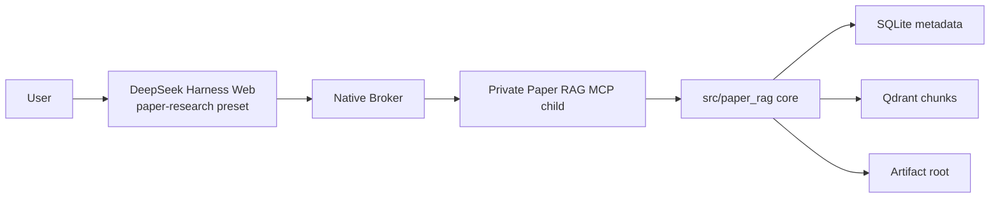

# Paper RAG Agent

Paper RAG Agent 是面向学术论文的本地 RAG / Agentic RAG 项目。它可以把
arXiv、PDF URL 或本地 PDF 入库，解析论文，切分 chunk，建立 SQLite + Qdrant
混合索引，并通过 DeepSeek Harness 的 `paper-research` 预设和私有 MCP 工具完成
带引用约束的研究问答、发现、知识构建、交付物和反馈闭环。

默认交互入口是 DeepSeek Harness，本仓库不再包含旧宿主源码。

## 快速开始

### 1. 安装 Python 包

```bash
python -m venv .venv
. .venv/bin/activate
python -m pip install -U pip
python -m pip install -e ".[dev,ingest,embed,deliver,deliver-pdf,harness]"
```

### 2. 配置环境

```bash
cp .env.example .env
```

关键模型默认值保持：

```bash
CHAT_MODEL=deepseek-v4-flash
SMALL_MODEL=deepseek-v4-flash
PAPER_RAG_DSH_PORT=3080
```

不要提交 `.env`、API key、`data/index`、runtime credentials、真实 PDF 或临时测试数据。

### 3. 初始化本地索引

```bash
make qdrant-up
make init-store
```

### 4. 安装并启动 DeepSeek Harness

```bash
make dsh-install
make dsh-doctor
make dsh-start
```

默认 UI 使用 `paper-research` preset，通过 Native Broker 启动私有 Paper RAG MCP
child。核心包位于 `src/paper_rag/`，宿主适配位于
`integrations/deepseek-harness/`。

## 常用命令

```bash
make dsh-smoke
make dsh-test
make test
make smoke
make secret-scan
make eval-golden
make eval-golden-qa
make eval-citation-audit
make eval-claims
make verify-p0
```

离线 QA 示例：

```bash
make ingest ID=2310.12345
make ask Q='What problem does this paper solve?'
```

## 架构



设计边界：

- `src/paper_rag/` 不导入 DSH、Cordis 或 UI 代码。
- MCP 工具只暴露 schema 化结果，凭证和用户/session authority 不进入模型可见上下文。
- Session/runtime 数据与 Paper RAG 主数据分离；清理 DSH runtime 不删除论文库。
- 写入类工具必须显式审批，真实论文库写入 smoke 不在迁移 Gate 中自动执行。

## 数据目录

常见本地目录：

```text
data/index/                    SQLite、Qdrant 本地索引、Gate report
data/runtime/deepseek-harness/ DSH profile/session/runtime
data/papers/                   原始论文文件
data/parsed/                   解析产物和本地 assets
artifacts/                     交付物输出
```

`data/` 默认不提交。

## 文档

- [docs/README.md](docs/README.md)：文档地图和 ADR 索引
- [docs/ARCHITECTURE.md](docs/ARCHITECTURE.md)：系统架构
- [docs/SYSTEM_DESIGN.md](docs/SYSTEM_DESIGN.md)：端到端设计
- [docs/OPERATIONS.md](docs/OPERATIONS.md)：运行手册
- [specs/20260813-deepseek-harness-migration/](specs/20260813-deepseek-harness-migration/)：迁移规格、测试矩阵和 Gate 证据
