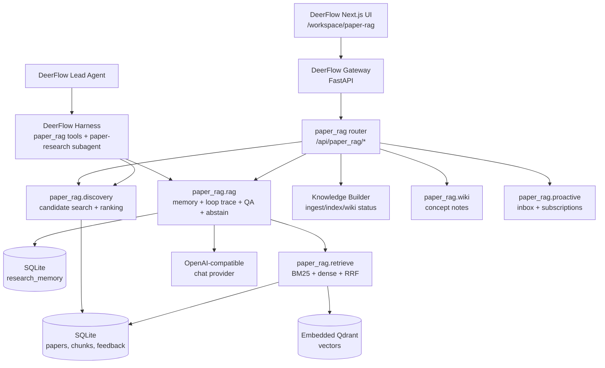
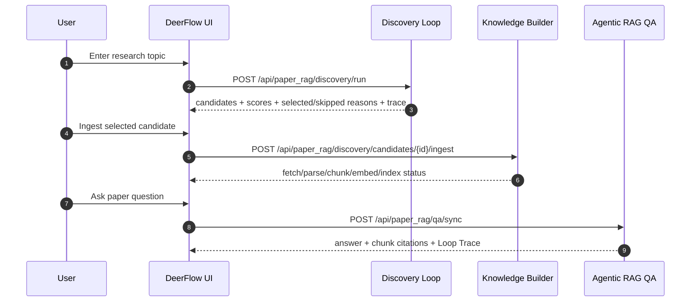
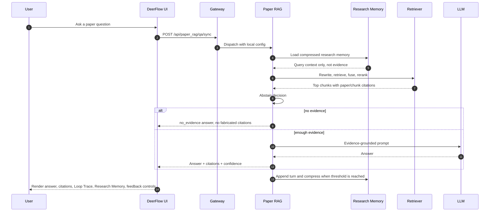

# Paper RAG Agent

[](https://github.com/Ttttt-s/paper-rag-agent/actions)
[](https://codecov.io/gh/Ttttt-s/paper-rag-agent)
[]()
[](LICENSE)

An open-source academic-paper RAG agent with a runnable DeerFlow workspace UI.
It can ingest papers, build a local hybrid index, answer literature questions
with citations, generate wiki-style concept notes, collect feedback, and run a
course/interview-grade RAG Eval Harness. The DeerFlow workspace also exposes the
internal Agentic RAG loop, a Paper RAG-specific research memory layer, and a
Knowledge Builder view for paper indexing status. It also includes a bounded
Paper Discovery Loop for finding candidate papers before they are ingested into
the evidence index.

The repository is intended to be useful in two modes:

- **Standalone Paper RAG**: Python package, CLI scripts, local SQLite/Qdrant
  index, retrieval, QA, wiki, feedback, and eval tools.
- **Embedded DeerFlow App**: a modified DeerFlow checkout under
  `integrations/deer-flow` that hosts the Paper RAG API and the
  `/workspace/paper-rag` Next.js UI.
- **DeerFlow Harness Extension**: Paper RAG tools and a `paper-research`
  subagent registered under DeerFlow's harness runtime, so the lead agent can
  call the same research capability through tools instead of only through the
  dedicated UI page.

The beta target is a complete local project experience. Production deployment,
CI golden gates, monitoring, backups, multi-tenant hardening, and cost
accounting are deliberately left outside the default setup.

## Course / Resume Project Pack

This repository also includes a course-ready project pack for students who want
to turn the system into a resume project and defend it in interviews:

| File | Purpose |
|---|---|
| [`course/README.md`](course/README.md) | Course material index |
| [`course/student_quickstart.md`](course/student_quickstart.md) | Student runbook from clone to UI demo |
| [`course/demo_pack.md`](course/demo_pack.md) | Fixed demo papers, 10+ standard questions, and live demo script |
| [`course/troubleshooting_faq.md`](course/troubleshooting_faq.md) | Common install/runtime/eval failures and fixes |
| [`course/paper_rag_agent_project_manual.md`](course/paper_rag_agent_project_manual.md) | Full Chinese technical manual for RAG, DeerFlow, resume, and interview prep |
| [`course/paper_rag_agent_project_manual.pdf`](course/paper_rag_agent_project_manual.pdf) | PDF version of the course manual |

## What You Get

| Area | Included |
|---|---|
| Retrieval | SQLite metadata, FTS5/BM25 sparse search, embedded Qdrant dense search, RRF fusion |
| Discovery | Topic -> arXiv/Semantic Scholar search, dedup, relevance ranking, selected/skipped reasons, manual ingest |
| QA | OpenAI-compatible LLM calls, query rewrite, reflect loop, abstain/no-evidence guard, citations |
| Loop Engineering | Product-readable loop trace for intent, retrieval rounds, reflect, abstain, citations, latency placeholder |
| Research Memory | Paper RAG-specific compressed memory for research continuity; never used as final evidence |
| Harness | LangChain tool adapters for `paper_qa`, `paper_search`, `paper_section`, `paper_compare`, `paper_discover`, `wiki_lookup`, `export_bibtex`, plus a `paper-research` subagent |
| UI | DeerFlow-style `/workspace/paper-rag` page for QA, Loop Trace, Discovery Loop, Knowledge Builder, wiki, ingest, feedback, inbox, subscriptions |
| Ingest | arXiv/PDF ingest path with PyMuPDF fallback and optional MinerU parser |
| Feedback | Helpful/not-helpful events, hard-case collection, eval item suggestions |
| Evaluation | 60-item strict golden set, 40-item real/stress set, chunk labels, strict gates, Markdown reports, retrieval ablation |
| Safety | `.env` and runtime data ignored, local secret scanner, evidence-only fallback |

## Prerequisites

For the full DeerFlow UI path, use these versions:

- Python 3.12 for the embedded DeerFlow backend.
- Node.js 20+ with Corepack enabled.
- `uv` for DeerFlow backend dependency installation.
- A local shell on macOS/Linux.
- An OpenAI-compatible chat provider key for real QA generation.

The standalone Python package supports Python 3.10+, but the bundled DeerFlow
backend declares Python 3.12+, so the recommended setup below uses one Python
3.12 virtualenv for everything.

## Quickstart: Full Local App

Clone the repository and install the backend/runtime dependencies:

```bash
git clone https://github.com/Ttttt-s/paper-rag-agent.git
cd paper-rag-agent

# Install uv if needed, then create DeerFlow's backend virtualenv.
python3 -m pip install -U uv
uv python install 3.12

cd integrations/deer-flow/backend
uv sync --python 3.12
cd ../../..

# Install Paper RAG into the same backend venv.
export PY="$PWD/integrations/deer-flow/backend/.venv/bin/python"
$PY -m pip install -U pip
$PY -m pip install -e ".[dev,embed,ingest]"
```

Install the frontend dependencies:

```bash
cd integrations/deer-flow/frontend
corepack enable
corepack pnpm install
cd ../../..
```

Create your local environment file:

```bash
cp .env.example .env
```

Edit `.env` with your own provider values. For DeepSeek or any
OpenAI-compatible provider:

```bash
OPENAI_BASE_URL=https://api.deepseek.com
OPENAI_API_KEY=sk-your-key-here
CHAT_MODEL=deepseek-chat
SMALL_MODEL=deepseek-chat
PAPER_RAG_CONFIG=config/local.yaml
```

Initialize the local store and ingest one starter paper:

```bash
make init-store
make ingest ID=2310.11511
```

Start the DeerFlow gateway:

```bash
make deerflow-backend
```

In a second terminal, start the UI:

```bash
make deerflow-frontend
```

Open:

```text
http://127.0.0.1:3000/workspace/paper-rag
```

Try:

- Ask: `What is Self-RAG?`
- Discovery Loop: search a topic such as `agentic rag loop engineering`, inspect scores/reasons, and ingest selected candidates.
- Loop Trace: inspect intent, retrieval rounds, abstain, and citation state.
- Research Memory: continue a multi-turn thread and watch compressed memory warm up.
- Knowledge Builder: confirm the ingested paper moves through fetch, parse, chunk, embed, index, and wiki states.
- Wiki: generate a concept note for an indexed paper.
- Feedback: click helpful/not helpful after an answer.
- Subscriptions: add, pause, resume, and delete a topic subscription.

## Smoke Test The App

With the backend running:

```bash
make deerflow-smoke
```

For a real QA check that fails if the app only returns evidence-only fallback:

```bash
$PY scripts/deerflow_smoke.py \
  --base-url http://127.0.0.1:8001 \
  --timeout 180 \
  --qa-question "What is Self-RAG?" \
  --require-llm-answer
```

A healthy runtime status should look conceptually like:

```text
ok   200 runtime_status: llm-ready; embed-ok; qdrant-ok; vectors=...
```

If you see `embed-missing`, install `.[embed]` into the backend venv. If you
see `qdrant-missing` or zero vectors after you already have parsed papers, run:

```bash
make deerflow-rebuild-index
```

## Standalone CLI Usage

The CLI path uses the same local index and config:

```bash
export PY="$PWD/integrations/deer-flow/backend/.venv/bin/python"

make init-store
make ingest ID=2310.11511
make ask Q="What is Self-RAG?"
```

For retrieval-only debugging without an LLM call:

```bash
$PY scripts/ask.py "What is Self-RAG?" --no-llm --top-k 8
```

For a local PDF:

```bash
$PY scripts/ingest_one.py --pdf /absolute/path/to/paper.pdf --title "My Paper"
```

## Evaluation And Regression Gates

Use these before changing retrieval, abstain thresholds, query rewrite, or the
DeerFlow integration layer:

```bash
make verify-p0
make eval-golden
make eval-golden-qa
make eval-report
make eval-citation-audit
make eval-ablation
```

What they mean:

| Command | Purpose |
|---|---|
| `make verify-p0` | Focused lint, focused tests, import smoke, secret scan, retrieval golden set |
| `make eval-golden` | Retrieval-only strict golden set; no chat API call, deterministic local rewrite |
| `make eval-golden-qa` | Full QA no-judge golden set; uses provider credentials for answer generation |
| `make eval-report` | Retrieval-only strict golden set plus `docs/RAG_EVAL_REPORT.md` |
| `make eval-citation-audit` | Full QA no-judge run plus `docs/RAG_CITATION_AUDIT.md` with per-citation diagnosis |
| `make eval-ablation` | Compare dense-only, sparse-only, hybrid RRF, hybrid+rerank, rewrite on/off |
| `make secret-scan` | Local scan for accidentally committed API keys |
| `make hard-cases` | Turn feedback events into candidate eval items |

The evaluation split is:

```text
tests/eval/qa_set.golden.jsonl  # 60 stable regression items, 45 chunk-labeled positives, 15 no-evidence
tests/eval/qa_set.real.jsonl    # 40 real/stress items for exploration and hard-case mining
```

The retrieval-only gate works like a search-engine test: each item has expected
paper/chunk IDs, the runner retrieves top-k chunks, and the metrics compare IDs
directly. It does not ask a model to judge semantic quality. The QA/no-judge
runner then adds answer/citation/no-answer checks. It separates
`relevant_chunk_ids` for retrieval recall from `citation_chunk_ids` for chunks
that can directly support answer citations. The optional LLM judge is reserved
for manual quality reports.

Latest local strict retrieval baseline (`make eval-golden`, top-k=10):

| Metric | Value |
|---|---:|
| Positive paper recall@10 | 0.989 |
| Positive paper MRR | 0.989 |
| Positive chunk recall@10 | 0.811 |
| Chunk label coverage | 1.000 |
| FPR@10 before first evidence | 0.000 |
| Errors | 0 |

Latest local strict QA/no-judge baseline (`make eval-golden-qa`, top-k=10):

| Metric | Value |
|---|---:|
| Citation existence | 1.000 |
| Citation precision | 0.867 |
| Citation paper precision | 0.922 |
| Must-contain coverage | 0.933 |
| No-answer success | 1.000 |
| No-answer direct abstain | 0.933 |
| Errors | 0 |

QA generation uses deterministic evidence selection before calling the LLM:
the full retrieval window is still returned as `chunks`, but only the compact
`evidence_chunks` set is placed in the prompt and allowed citation list.

Latest retrieval ablation (`make eval-ablation`, positive items only):

| Strategy | Paper recall@10 | Paper MRR | Chunk recall@10 | Avg latency |
|---|---:|---:|---:|---:|
| Dense only | 0.922 | 0.974 | 0.767 | 198.22 ms |
| Sparse only | 0.956 | 0.782 | 0.567 | 2.19 ms |
| Hybrid RRF | 0.944 | 0.959 | 0.811 | 152.66 ms |
| Hybrid + rerank, no rewrite | 0.989 | 0.959 | 0.733 | 156.95 ms |
| Hybrid + rerank + local rewrite | 0.989 | 0.989 | 0.811 | 220.52 ms |

## Repository Layout

```text
paper-rag-agent/
|-- src/paper_rag/                         # Standalone Python package
|   |-- rag/                               # QA loop, research memory, abstain, streaming, query rewrite
|   |-- discovery/                         # Paper discovery loop, candidate ranking, trace, SQLite run store
|   |-- retrieve/                          # Dense/sparse retrieval, formatting, rerank
|   |-- store/                             # SQLite + Qdrant ingest/index stores
|   |-- parse/ and chunk/                  # PDF parsing and chunk construction
|   |-- wiki/                              # Self-evolving concept notes
|   |-- proactive/                         # Inbox, subscriptions, digests
|   `-- feedback/                          # Feedback event storage
|-- integrations/deer-flow/                # Embedded runnable DeerFlow app
|   |-- backend/packages/harness/deerflow/
|   |   |-- community/paper_rag/            # DeerFlow Harness tool adapters
|   |   `-- subagents/builtins/             # paper-research subagent config
|   |-- backend/app/gateway/routers/
|   |   `-- paper_rag.py                   # Paper RAG FastAPI adapter
|   `-- frontend/src/app/workspace/paper-rag/
|       `-- page.tsx                       # Paper RAG workspace UI
|-- scripts/                               # Setup, ingest, smoke, eval helper scripts
|-- tests/                                 # Unit/integration/eval tests
|-- tests/eval/qa_set.golden.jsonl         # Golden regression set
|-- course/                                # Course runbooks, demo pack, PDF manual
|-- config/local.yaml                      # Docker-free local config
`-- docs/                                  # Design, integration, operations notes
```

## Architecture



## Discovery Flow

Discovery is deliberately separate from QA evidence. It helps students and the
agent find promising papers, but a candidate does not become answer evidence
until it is ingested, parsed, chunked, embedded, indexed, and later retrieved by
the QA loop.



Default local config uses embedded Qdrant at:

```text
data/index/qdrant_embedded
```

That keeps the demo Docker-free. For multi-process or production-style use,
switch `config/*.yaml` to a Qdrant server URL.

## Request Flow



## Common Troubleshooting

| Symptom | Likely Cause | Fix |
|---|---|---|
| `integrations/deer-flow/backend/.venv/bin/python: no such file` | DeerFlow backend venv was not created | Run `cd integrations/deer-flow/backend && uv sync --python 3.12` |
| Backend starts but QA says LLM unavailable | Missing `.env` values or provider failure | Check `OPENAI_BASE_URL`, `OPENAI_API_KEY`, `CHAT_MODEL` |
| `/api/paper_rag/status` shows `embed-missing` | `FlagEmbedding` extra not installed | `$PY -m pip install -e ".[embed,ingest]"` |
| Dense retrieval has zero vectors | Store initialized but papers not indexed | `make ingest ID=2310.11511` or `make deerflow-rebuild-index` |
| Frontend cannot reach API | Backend not running or wrong port | Start `make deerflow-backend`; default port is `8001` |
| `pnpm` command missing | Corepack not enabled | `corepack enable` then rerun `corepack pnpm install` |
| Slow first QA/ingest | Model weights downloading | Wait for BGE model download; cache lives under local model/cache dirs |
| Secret scan fails | A key-like value is in tracked text | Move real secrets into `.env`; never commit provider keys |

## Configuration Notes

Important local files:

| File | Purpose |
|---|---|
| `.env.example` | Copy to `.env` and fill provider credentials |
| `config/local.yaml` | Recommended Docker-free local config |
| `config/default.yaml` | Baseline package config |
| `docs/integration/deerflow_embedded.md` | Detailed DeerFlow integration runbook |
| `docs/P012_COMPLETION_PLAN.md` | Current P0/P1/P2 completion map |
| `docs/MINERU_SETUP.md` | Optional MinerU setup for richer PDF parsing |

Runtime data is intentionally ignored by git:

```text
.env
data/
.deer-flow/
integrations/deer-flow/**/.venv
integrations/deer-flow/frontend/.next
integrations/deer-flow/frontend/node_modules
integrations/deer-flow/frontend/public/demo/threads/*/user-data/
```

## Development

Use the backend venv as the project Python:

```bash
export PY="$PWD/integrations/deer-flow/backend/.venv/bin/python"

$PY -m ruff check src tests
$PY -m pytest -q --ignore=tests/eval
$PY scripts/secret_scan.py
```

Frontend checks:

```bash
cd integrations/deer-flow/frontend
corepack pnpm typecheck
corepack pnpm exec eslint src/app/workspace/paper-rag/page.tsx
```

Focused DeerFlow backend integration checks:

```bash
make deerflow-paper-rag-test
```

This target intentionally uses `integrations/deer-flow/backend/.venv/bin/python`
through `DEERFLOW_BACKEND_PY`; the root `.venv` is not a complete DeerFlow
backend environment. If that interpreter does not exist yet, run
`cd integrations/deer-flow/backend && uv sync --python 3.12` first.

## Beta Scope

Complete for the local beta:

- Real Paper RAG runtime with local index and OpenAI-compatible LLM.
- DeerFlow gateway adapter and DeerFlow-style Paper RAG workspace UI.
- QA, citations, loading/error/no-evidence states.
- Knowledge Builder, Wiki, Ingest, Feedback, Inbox, and Subscription workflows.
- Golden-set baseline and RAG tuning hooks.
- Local secret scanning and runtime-data ignore rules.

Deferred by design for now:

- Cloud deployment automation.
- CI golden gate enforcement.
- Production permission isolation.
- Backup/restore playbooks.
- Monitoring dashboards as required local setup.
- Larger real-world golden sets.
- Cost accounting.

## Further Reading

- [Embedded DeerFlow Integration](docs/integration/deerflow_embedded.md)
- [P0/P1/P2 Completion Plan](docs/P012_COMPLETION_PLAN.md)
- [System Design](docs/SYSTEM_DESIGN.md)
- [Operations Notes](docs/OPERATIONS.md)
- [ADR Index](docs/adrs/)
- [MinerU Setup](docs/MINERU_SETUP.md)

## License

MIT. See [LICENSE](LICENSE).
