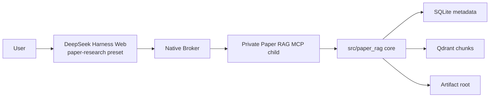

# Paper RAG Agent

Paper RAG Agent is a local RAG / Agentic RAG system for academic papers. It can
ingest arXiv IDs, PDF URLs, or local PDFs; parse papers; chunk evidence; build a
SQLite + Qdrant hybrid index; and answer research questions through the
DeepSeek Harness `paper-research` preset and a private MCP tool bridge.

The default interactive entry point is DeepSeek Harness. This repository no
longer contains the retired legacy host source tree.

## Quick Start

### 1. Install the Python package

```bash
python -m venv .venv
. .venv/bin/activate
python -m pip install -U pip
python -m pip install -e ".[dev,ingest,embed,deliver,deliver-pdf,harness]"
```

### 2. Configure environment

```bash
cp .env.example .env
```

Model defaults stay on flash:

```bash
CHAT_MODEL=deepseek-v4-flash
SMALL_MODEL=deepseek-v4-flash
PAPER_RAG_DSH_PORT=3080
```

Do not commit `.env`, API keys, `data/index`, runtime credentials, real PDFs, or
temporary test data.

### 3. Initialize the local index

```bash
make qdrant-up
make init-store
```

### 4. Install and start DeepSeek Harness

```bash
make dsh-install
make dsh-doctor
make dsh-start
```

The default UI uses the `paper-research` preset. Native Broker starts a private
Paper RAG MCP child. Core code lives in `src/paper_rag/`; the host adapter lives
in `integrations/deepseek-harness/`.

## Common Commands

```bash
make dsh-smoke
make dsh-test
make test
make smoke
make secret-scan
make eval-golden
make eval-golden-qa
make eval-citation-audit
make eval-claims
make verify-p0
```

Offline QA example:

```bash
make ingest ID=2310.12345
make ask Q='What problem does this paper solve?'
```

## Architecture



Design boundaries:

- `src/paper_rag/` does not import DSH, Cordis, or UI code.
- MCP tools expose structured results only; credentials and user/session
  authority stay out of model-visible context.
- Session/runtime data is separated from the Paper RAG source-of-truth data.
- Write tools require explicit approval; live smoke that writes the real paper
  library is not executed automatically by migration gates.

## Data Directories

Common local directories:

```text
data/index/                    SQLite, local Qdrant index, Gate reports
data/runtime/deepseek-harness/ DSH profile/session/runtime
data/papers/                   Source PDFs
data/parsed/                   Parsed outputs and local assets
artifacts/                     Deliverable output
```

`data/` is ignored by default.

## Documentation

- [docs/README.md](docs/README.md): documentation map and ADR index
- [docs/ARCHITECTURE.md](docs/ARCHITECTURE.md): system architecture
- [docs/SYSTEM_DESIGN.md](docs/SYSTEM_DESIGN.md): end-to-end design
- [docs/OPERATIONS.md](docs/OPERATIONS.md): operations guide
- [specs/20260813-deepseek-harness-migration/](specs/20260813-deepseek-harness-migration/): migration spec, test matrix, and Gate evidence
