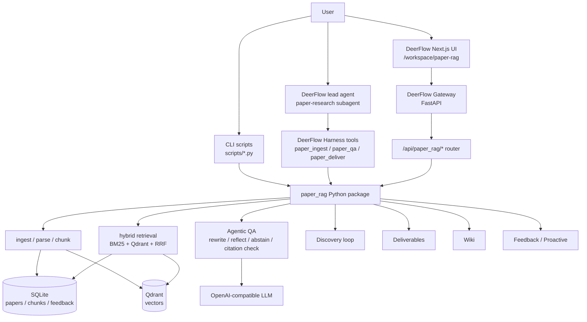

# Paper RAG Agent

[中文](README.md) | English

[](https://github.com/Ttttt-s/paper-rag-agent/actions)
[](https://codecov.io/gh/Ttttt-s/paper-rag-agent)
[](https://www.python.org/)
[](LICENSE)

Paper RAG Agent is a local RAG / Agentic RAG system for academic papers. It can ingest arXiv papers, PDF URLs, or local PDFs; parse and chunk them; build a SQLite + Qdrant hybrid index; and answer paper questions through an evidence-constrained Agentic QA loop. The repository also embeds a runnable DeerFlow workspace UI for paper discovery, ingestion, QA, trace inspection, knowledge building, feedback, subscriptions, and deliverable generation.

The repository can be used in three modes:

| Mode | Best for | Entry point |
|---|---|---|
| Standalone Python package | Calling paper RAG from CLI scripts or your own service | `src/paper_rag/`, `scripts/` |
| DeerFlow local app | Running the full browser product locally | `integrations/deer-flow/` |
| DeerFlow Agent extension | Letting the DeerFlow lead agent call paper tools automatically | `deerflow.community.paper_rag`, `paper-research` subagent |

Local usage is the main path documented here. Production deployment, cloud permissions, backup and restore, cost controls, and multi-tenant isolation have partial engineering support, but this README focuses on getting the project running locally.

## Features

| Capability | Details |
|---|---|
| Paper ingestion | arXiv ID, PDF URL, and local PDF input; PyMuPDF fallback and optional MinerU parsing |
| Multimodal figure/table summaries | Optionally uses an OpenAI-compatible vision API to summarize MinerU-extracted figures/tables before indexing; API failure can fall back to a lazy local Qwen2.5-VL adapter |
| Hybrid retrieval | SQLite metadata, FTS5/BM25 sparse retrieval, Qdrant dense vectors, RRF fusion, optional BGE reranker |
| Agentic QA | Query rewrite, HyDE, reflective retrieval, evidence selection, citation checking, no-evidence abstention |
| Trace and auditability | QA returns intent, rewrites, retrieval rounds, selected evidence, abstain decisions, and citations for debugging the path from retrieval to final answer |
| Citation constraints | Answers must cite retrieved chunks with `[chunk:<id>]`; fabricated `[1]` or author-year citations are rejected |
| Paper Discovery | Finds candidate papers for a topic and explains candidate scores and selected/skipped reasons |
| Knowledge Builder | Shows fetch, parse, chunk, embed, index, and wiki build state in the UI |
| Research Memory | Compresses multi-turn research context; memory is context only, not final evidence |
| Self-evolving Wiki | Generates concept notes, related concepts, and open questions for indexed papers; disabled by default |
| Deliverables | Markdown survey, PPTX, DOCX, LaTeX/BibTeX, and PDF outputs |
| Feedback loop | Captures thumbs/copy events and hard cases for later evaluation and threshold tuning |
| Proactive Agent | Subscriptions, inbox, digest, stale paper reminders, and auto-ingest hook |
| DeerFlow UI | `/workspace/paper-rag` page for QA, Discovery, Knowledge Builder, Wiki, Feedback, Inbox, and Subscriptions |
| DeerFlow Agent tools | `paper_ingest`, `paper_qa`, `paper_search`, `paper_section`, `paper_compare`, `paper_discover`, `wiki_lookup`, `export_bibtex`, `paper_deliver` |
| RAG / Agent evaluation | Retrieval golden set, QA no-judge eval, citation audit, claim eval, ablation, LLM recall comparison, and DeerFlow Harness/Gateway regressions from recall to Agent tool answers |
| Security and user boundary | DeerFlow gateway routes require auth and have user_id propagation tests; local demo may disable auth, production must enable it |
| Observability | Gateway metrics, Prometheus, Grafana dashboard, secret scan, smoke test |

## Architecture



### Discovery and QA boundary

Discovery only finds candidate papers. Candidate titles, abstracts, and external metadata cannot be used as final answer evidence. A candidate must be ingested, parsed, chunked, embedded, indexed, and retrieved by the QA loop before it can appear in final citations.

## Requirements

| Component | Recommended version | Notes |
|---|---|---|
| Python | 3.12 for DeerFlow; standalone package supports 3.10+ | DeerFlow backend currently recommends 3.12 |
| Node.js | 20+ | DeerFlow frontend uses pnpm / Corepack |
| uv | Latest stable | Used for DeerFlow backend dependencies |
| Docker | Optional | Needed only for Qdrant server, proactive sidecar, or observability stack |
| LLM key | OpenAI-compatible | DeepSeek, OpenAI, DashScope/Qwen, and similar compatible endpoints |

The default local config `config/local.yaml` uses embedded Qdrant:

```yaml
qdrant:
  url: ""
  local_path: ./data/index/qdrant_embedded
```

So the minimal local demo does not require a separate Docker Qdrant service.

## Quick Start: Full DeerFlow UI

### 1. Clone

```bash
git clone https://github.com/Ttttt-s/paper-rag-agent.git
cd paper-rag-agent
```

### 2. Prepare the DeerFlow backend Python environment

```bash
python3 -m pip install -U uv
uv python install 3.12

cd integrations/deer-flow/backend
uv sync --python 3.12
cd ../../..

export PY="$PWD/integrations/deer-flow/backend/.venv/bin/python"
$PY -m pip install -U pip
$PY -m pip install -e ".[dev,embed,ingest,deliver,deliver-pdf,proactive,deerflow]"
```

If you only need lightweight tests, you may omit `embed`. For real ingestion and QA, install the extras above.

### 3. Install frontend dependencies

```bash
cd integrations/deer-flow/frontend
corepack enable
corepack pnpm install
cd ../../..
```

### 4. Configure the LLM provider

```bash
cp .env.example .env
```

Edit `.env` with your OpenAI-compatible provider:

```bash
OPENAI_BASE_URL=https://api.deepseek.com
OPENAI_API_KEY=sk-your-key-here
CHAT_MODEL=deepseek-chat
SMALL_MODEL=deepseek-chat
PAPER_RAG_CONFIG=config/local.yaml
```

Keep real keys in local `.env` files or shell environment variables. Do not commit secrets.

Optional: to summarize MinerU-extracted figures/tables with a multimodal model during ingest, enable `vision.enabled` in `config/local.yaml` and configure an OpenAI-compatible vision model:

```bash
VISION_BASE_URL=https://your-vision-provider.example/v1
VISION_API_KEY=sk-your-vision-key
VISION_MODEL=qwen-vl-plus
```

The local fallback is a lazy Qwen2.5-VL adapter. It is only attempted when `vision.fallback_local: true` and local dependencies are installed:

```bash
$PY -m pip install -e ".[vision-local]"
```

### 5. Initialize the store and ingest one paper

```bash
$PY scripts/init_store.py
$PY scripts/ingest_one.py --arxiv 2310.11511
```

You can also ingest a local PDF:

```bash
$PY scripts/ingest_one.py --pdf /absolute/path/to/paper.pdf --title "My Paper"
```

### 6. Start backend and frontend

Terminal 1:

```bash
make deerflow-backend
```

Terminal 2:

```bash
make deerflow-frontend
```

Open:

```text
http://127.0.0.1:3000/workspace/paper-rag
```

Try:

- Ask: `What is Self-RAG?`
- Discovery Loop: search `agentic rag loop engineering`, inspect candidate reasons, and ingest selected papers
- Loop Trace: inspect intent, rewrite, retrieval rounds, abstain decisions, and citations
- Knowledge Builder: inspect build state from fetch to wiki
- Wiki: generate or view paper concept notes
- Feedback: mark answers helpful or not helpful
- Subscriptions: create, pause, resume, and delete topic subscriptions
- Deliver: generate Markdown survey, PPT, Word, LaTeX/BibTeX, or PDF output

## CLI Usage

You can use the Python package and scripts without starting the DeerFlow UI.

```bash
python3 -m venv .venv
source .venv/bin/activate
python -m pip install -U pip
python -m pip install -e ".[dev,ingest,embed,deliver,deliver-pdf,deerflow]"
```

Initialize:

```bash
python scripts/init_store.py
python scripts/ingest_one.py --arxiv 2310.11511
```

Ask:

```bash
python scripts/ask.py "What is Self-RAG?"
python scripts/ask.py "What is the main contribution?" --paper-id arxiv:2310.11511
python scripts/ask.py "What is Self-RAG?" --no-llm --top-k 8
```

Batch ingest:

```bash
cat > ids.txt <<EOF
arxiv:2310.11511
url:https://example.com/paper.pdf
EOF

python scripts/ingest_batch.py --file ids.txt
```

## DeerFlow Agent Tools

Paper RAG is registered as DeerFlow Harness tools and is used by the built-in `paper-research` subagent.

| Tool | Purpose |
|---|---|
| `paper_ingest` | Ingest an arXiv ID, PDF URL, or local PDF |
| `paper_qa` | Run evidence-constrained QA over indexed papers |
| `paper_search` | Search the local paper library |
| `paper_section` | Read a section from a specific paper |
| `paper_compare` | Compare multiple papers across requested dimensions |
| `paper_discover` | Discover candidate papers by topic |
| `wiki_lookup` | Look up self-evolving wiki concept notes |
| `export_bibtex` | Export BibTeX |
| `paper_deliver` | Generate Markdown / PPTX / DOCX / LaTeX+BIB / PDF |

Related files:

```text
integrations/deer-flow/backend/packages/harness/deerflow/community/paper_rag/tools.py
integrations/deer-flow/backend/packages/harness/deerflow/subagents/builtins/paper_research.py
integrations/deer-flow/skills/public/paper-research/SKILL.md
```

## HTTP API

The DeerFlow gateway exposes `/api/paper_rag/*`. Common endpoints:

| Method | Path | Description |
|---|---|---|
| GET | `/api/paper_rag/status` | Runtime status: LLM, embedding, Qdrant, index counts |
| POST | `/api/paper_rag/qa` | Streaming QA over SSE |
| POST | `/api/paper_rag/qa/sync` | Synchronous QA |
| GET | `/api/paper_rag/papers` | Current user's papers |
| POST | `/api/paper_rag/papers/ingest` | Ingest arXiv / PDF |
| GET | `/api/paper_rag/knowledge/builds` | Knowledge Builder state |
| POST | `/api/paper_rag/discovery/run` | Run paper discovery |
| GET | `/api/paper_rag/discovery/runs` | List discovery runs |
| GET | `/api/paper_rag/discovery/runs/{run_id}` | Discovery run details |
| POST | `/api/paper_rag/discovery/candidates/{candidate_id}/ingest` | Ingest a discovery candidate |
| GET | `/api/paper_rag/wiki/{paper_id}` | Read wiki notes |
| POST | `/api/paper_rag/wiki/{paper_id}/generate` | Generate wiki notes |
| POST | `/api/paper_rag/deliver` | Generate deliverables |
| POST | `/api/paper_rag/feedback` | Write feedback |
| GET | `/api/paper_rag/feedback/recent` | Recent feedback |
| GET | `/api/paper_rag/feedback/stats` | Feedback statistics |
| GET | `/api/paper_rag/subscriptions` | List subscriptions |
| POST | `/api/paper_rag/subscriptions` | Create a subscription |
| PATCH | `/api/paper_rag/subscriptions/{sub_id}` | Enable or disable a subscription |
| DELETE | `/api/paper_rag/subscriptions/{sub_id}` | Delete a subscription |
| GET | `/api/paper_rag/inbox` | List inbox items |
| GET | `/api/paper_rag/inbox/stream` | Inbox SSE stream |
| POST | `/api/paper_rag/inbox/{item_id}/read` | Mark inbox item as read |
| POST | `/api/paper_rag/inbox/{item_id}/dismiss` | Dismiss an inbox item |
| POST | `/api/paper_rag/proactive/digest/run` | Manually trigger digest |
| POST | `/api/paper_rag/proactive/stale/run` | Manually trigger stale scan |

The local `make deerflow-backend` target sets `DEER_FLOW_AUTH_DISABLED=1` for demo convenience. Do not use that setting for public or production deployments. Enable DeerFlow auth and session middleware instead.

## Deliverables

Supported formats are defined in `src/paper_rag/deliver/dispatch.py`:

```text
markdown_survey
pptx
docx
latex_bib
pdf
```

Python example:

```python
from paper_rag.deliver import dispatch

result = dispatch(
    "markdown_survey",
    ["arxiv:2310.11511"],
    title="Self-RAG Reading Notes",
)

print(result.filename)
print(result.content_type)
```

In Agent / DeerFlow flows, use `paper_deliver`.

## Evaluation and Quality Gates

Evaluation is not limited to vector top-k. The suite covers the full path: recall -> evidence selection -> citation -> abstention -> semantic claims -> DeerFlow tool calls -> Gateway API. If retrieval does not find evidence, a fluent Agent answer still does not pass.

| Layer | What it checks | Command / file | Key metrics or assertions |
|---|---|---|---|
| Retrieval | Whether the question retrieves the correct paper / chunk | `make eval-golden`, `tests/eval/qa_set.golden.jsonl` | `positive_paper_recall@10`, `positive_chunk_recall@10`, MRR, nDCG, FPR |
| RAG generation | Whether answers cite only selected evidence and abstain when evidence is missing | `make eval-golden-qa`, `make eval-citation-audit` | `cite_existence`, `cite_precision`, `cite_recall`, `must_contain`, `no_answer_success_rate` |
| Semantic claims | Whether the final answer covers key conclusions and grounds them with citations | `make eval-claims`, `make eval-claims-report` | `claim_recall`, `grounded_claim_recall`, `forbidden_claim_violations` |
| Strategy comparison | Whether dense / sparse / hybrid / rerank / rewrite / HyDE actually improve recall | `make eval-ablation`, `make eval-llm-recall` | `rewrite_gain_count`, `rewrite_harm_rate`, latency |
| Agent tools | Whether the DeerFlow lead agent / `paper-research` subagent can call paper tools and preserve auditable payloads | `make deerflow-paper-rag-test`, `integrations/deer-flow/backend/tests/test_paper_rag_harness_adapter.py` | tool registration, subagent registration, `paper_ingest` / `paper_discover` / `paper_deliver` contracts |
| Gateway product path | Whether UI/API entry points cover QA, ingest, discovery, wiki, feedback, proactive flows, auth, and user scope | `make deerflow-smoke`, `integrations/deer-flow/backend/tests/test_paper_rag_integration.py` | route readiness, auth required, secret redaction, user_id propagation |
| Operations gate | Basic code quality, imports, leaked secrets, and smoke coverage | `make verify-p0`, `scripts/_run_smoke.py`, `scripts/secret_scan.py` | lint/test/smoke/secret scan/errors |

Important boundaries:

- Discovery, Wiki, and Research Memory provide research context only. They are not final answer evidence.
- Final QA evaluation only trusts the current indexed chunks, selected evidence, and `[chunk:<id>]` citations.
- Agent evaluation focuses on DeerFlow tool contracts, evidence boundaries, error payloads, and auditable traces, not answer style alone.

Common commands:

```bash
make verify-p0
make eval-golden
make eval-golden-qa
make eval-report
make eval-citation-audit
make eval-ablation
make eval-claims
make eval-claims-report
make eval-llm-recall
make deerflow-smoke
make deerflow-paper-rag-test
```

| Command | Purpose |
|---|---|
| `make verify-p0` | Lint, focused tests, smoke, secret scan, golden retrieval |
| `make eval-golden` | Retrieval-only strict golden set |
| `make eval-golden-qa` | Full QA no-judge golden set |
| `make eval-citation-audit` | Generate citation audit report |
| `make eval-ablation` | Compare dense, sparse, hybrid, rerank, and rewrite strategies |
| `make eval-claims` | Claim-level QA gate |
| `make eval-llm-recall` | Compare no/local/LLM rewrite recall |
| `make deerflow-smoke` | Smoke running Paper RAG endpoints on the DeerFlow gateway |
| `make deerflow-paper-rag-test` | Run DeerFlow backend Paper RAG gateway integration tests |
| `make secret-scan` | Scan for accidentally committed API keys |

Evaluation data:

```text
tests/eval/README.md
tests/eval/qa_set.golden.jsonl
tests/eval/qa_set.real.jsonl
tests/eval/qa_set.claims.jsonl
```

Quick verification commands used during recent maintenance:

```bash
.venv/bin/ruff check --select E,F,W,I --ignore E501 src tests
PYTHONPATH=src .venv/bin/python scripts/_run_smoke.py
PYTHONPATH=src:tests .venv/bin/python -m pytest -q --ignore=tests/eval --ignore=tests/test_gateway_paper_rag.py --ignore=tests/test_middleware.py --ignore=tests/test_langgraph_middleware.py
PYTHONPATH=integrations/deer-flow/backend:integrations/deer-flow/backend/packages/harness:src .venv/bin/python -m pytest -q integrations/deer-flow/backend/tests/test_paper_rag_integration.py
PYTHONPATH=src:integrations/deer-flow/backend/packages/harness .venv/bin/python -m pytest -q integrations/deer-flow/backend/tests/test_paper_rag_harness_adapter.py
```

## Docker and Observability

The root `Dockerfile` is an optional standalone paper_rag image for CLI runs, embedding model warmup, or proactive cron:

```bash
make docker-build
docker build -t paper-rag:full --build-arg EXTRAS=deliver,deerflow,proactive .
```

Pre-warm BGE-M3:

```bash
make docker-build-bake
```

Run the standalone container in proactive cron mode:

```bash
docker run --rm \
  -v "$PWD/data:/opt/paper_rag/data" \
  -v "$PWD/config:/opt/paper_rag/config:ro" \
  --env-file .env \
  -e PAPER_RAG_CONFIG=/opt/paper_rag/config/local.yaml \
  -e PAPER_RAG_MODE=proactive \
  paper-rag:full proactive
```

DeerFlow production compose files live under `integrations/deer-flow/docker/`:

```bash
cd integrations/deer-flow/docker
docker compose -f docker-compose.yaml up -d
```

Prometheus / Grafana files live under `docs/integration/observability/`. If the DeerFlow compose stack is already running, start observability from `docs/integration`:

```bash
cd docs/integration
docker compose -f observability/docker-compose.observability.yaml up -d
```

Default observability URLs:

```text
Prometheus: http://localhost:9090
Grafana:    http://localhost:3001  admin/admin
```

## Configuration

| File | Purpose |
|---|---|
| `.env.example` | Local environment variable template |
| `config/local.yaml` | Recommended local demo config with embedded Qdrant |
| `config/default.yaml` | Default Python package config |
| `config/production.yaml` | Production-style example, suitable for remote Qdrant |
| `config/magic-pdf.json` | MinerU / magic-pdf config |

Key environment variables:

| Variable | Purpose |
|---|---|
| `PAPER_RAG_CONFIG` | Config path, commonly `config/local.yaml` |
| `PAPER_RAG_HOME` | Used by DeerFlow to locate the paper_rag package |
| `OPENAI_BASE_URL` | OpenAI-compatible endpoint |
| `OPENAI_API_KEY` | LLM provider key |
| `CHAT_MODEL` | Answer model |
| `SMALL_MODEL` | Smaller model; currently often the same as `CHAT_MODEL` |
| `VISION_BASE_URL` | Optional OpenAI-compatible vision endpoint for figure/table summaries |
| `VISION_API_KEY` | Optional vision model key |
| `VISION_MODEL` | Optional vision model name, for example `qwen-vl-plus` |
| `DEER_FLOW_AUTH_DISABLED` | May be `1` for local demo only; do not disable auth in production |

Runtime data is intentionally not committed:

```text
.env
data/
.deer-flow/
integrations/deer-flow/**/.venv
integrations/deer-flow/frontend/.next
integrations/deer-flow/frontend/node_modules
integrations/deer-flow/frontend/public/demo/threads/*/user-data/
```

## Repository Layout

```text
paper-rag-agent/
|-- src/paper_rag/                         # Standalone Python package
|   |-- ingest/                            # arXiv / URL / local PDF source
|   |-- parse/                             # PyMuPDF / MinerU parsing
|   |-- chunk/                             # text and multimodal chunk builder
|   |-- embed/                             # bge-m3 embedding
|   |-- store/                             # SQLite + Qdrant stores
|   |-- retrieve/                          # dense/sparse/hybrid retrieval
|   |-- rag/                               # Agentic QA, abstain, memory, streaming
|   |-- discovery/                         # Paper Discovery Loop
|   |-- wiki/                              # self-evolving wiki
|   |-- deliver/                           # markdown/pptx/docx/latex/pdf
|   |-- feedback/                          # feedback events and hard cases
|   |-- proactive/                         # subscriptions, inbox, digest, stale
|   |-- vision/                            # visual summaries for figure/table chunks
|   `-- tools/                             # LLM-agent-facing tool facades
|-- integrations/deer-flow/                # Runnable DeerFlow app
|   |-- backend/app/gateway/routers/       # paper_rag API router
|   |-- backend/packages/harness/deerflow/ # harness tools and subagents
|   |-- docker/                            # DeerFlow compose files
|   |-- frontend/src/app/workspace/paper-rag/
|   `-- skills/public/paper-research/
|-- scripts/                               # ingest, eval, smoke, operations
|-- tests/                                 # unit/integration/eval tests
|-- tests/eval/                            # golden/real/claims eval sets
|-- course/                                # course and interview material
|-- docs/                                  # architecture, ADR, operations, reports
|-- config/                                # local/default/production configs
|-- Dockerfile                             # optional standalone paper_rag image
`-- docker-entrypoint.sh                   # standalone container entrypoint
```

## Course and Interview Material

| File | Content |
|---|---|
| [course/README.md](course/README.md) | Course material index |
| [course/student_quickstart.md](course/student_quickstart.md) | Student runbook from clone to demo |
| [course/demo_pack.md](course/demo_pack.md) | Fixed demo paper, questions, and script |
| [course/troubleshooting_faq.md](course/troubleshooting_faq.md) | Common issues |
| [course/paper_rag_agent_project_manual.md](course/paper_rag_agent_project_manual.md) | Chinese project manual |
| [docs/INTERVIEW_NOTES.md](docs/INTERVIEW_NOTES.md) | Interview notes |

## Troubleshooting

| Symptom | Common cause | Fix |
|---|---|---|
| `integrations/deer-flow/backend/.venv/bin/python: no such file` | DeerFlow backend venv was not created | `cd integrations/deer-flow/backend && uv sync --python 3.12` |
| `pnpm` is missing | Corepack is not enabled | `corepack enable` |
| QA reports LLM unavailable | `.env` is missing or provider is unreachable | Check `OPENAI_BASE_URL`, `OPENAI_API_KEY`, `CHAT_MODEL` |
| `/api/paper_rag/status` shows `embed-missing` | Embedding extra is not installed | `$PY -m pip install -e ".[embed,ingest]"` |
| Dense retrieval returns 0 results | Store is not initialized or Qdrant collection is missing | `$PY scripts/init_store.py`; if needed, `make deerflow-rebuild-index` |
| First ingestion or QA is slow | Model weights are downloading for the first time | Wait for BGE / reranker model cache to finish |
| MinerU is unavailable | `magic-pdf` or models are missing | Use PyMuPDF fallback first, or see [docs/MINERU_SETUP.md](docs/MINERU_SETUP.md) |
| Figure/table summaries are missing | `vision.enabled` is disabled by default, or `VISION_*` is not configured | Enable `vision.enabled` and set `VISION_BASE_URL`, `VISION_API_KEY`, `VISION_MODEL`; for API fallback, install `.[vision-local]` and enable `vision.fallback_local` |
| Answer abstains | Retrieved evidence is insufficient or the question is outside the corpus | Ingest more papers, or use Discovery to find candidates |
| Secret scan fails | Key-like text entered tracked files | Move secrets to `.env`; never commit real keys |

## Development

Install development dependencies:

```bash
python -m pip install -e ".[dev,ingest,deerflow]"
```

Common checks:

```bash
ruff check src tests
pytest -q --ignore=tests/eval
PYTHONPATH=src python scripts/_run_smoke.py
python scripts/secret_scan.py
```

DeerFlow tests:

```bash
make deerflow-paper-rag-test
PYTHONPATH=src:integrations/deer-flow/backend/packages/harness \
  python -m pytest -q integrations/deer-flow/backend/tests/test_paper_rag_harness_adapter.py
```

Frontend checks:

```bash
cd integrations/deer-flow/frontend
corepack pnpm typecheck
corepack pnpm exec eslint src/app/workspace/paper-rag/page.tsx
```

## Further Reading

| Document | Content |
|---|---|
| [docs/ARCHITECTURE.md](docs/ARCHITECTURE.md) | Overall architecture |
| [docs/SYSTEM_DESIGN.md](docs/SYSTEM_DESIGN.md) | One-page system design |
| [docs/OPERATIONS.md](docs/OPERATIONS.md) | Deployment and operations |
| [docs/integration/deerflow_embedded.md](docs/integration/deerflow_embedded.md) | DeerFlow embedded integration guide |
| [docs/VERIFICATION_REPORT.md](docs/VERIFICATION_REPORT.md) | Full-stack verification report |
| [docs/RAG_EVAL_GUIDE.md](docs/RAG_EVAL_GUIDE.md) | RAG evaluation guide |
| [tests/eval/README.md](tests/eval/README.md) | Eval sets, metrics, and gates |
| [docs/adrs/](docs/adrs/) | Architecture decision records |
| [docs/MINERU_SETUP.md](docs/MINERU_SETUP.md) | MinerU setup |
| [docs/PERF_BASELINE.md](docs/PERF_BASELINE.md) | Performance baseline |

## Branch Notes

The current `main` branch includes DeerFlow source code at:

```text
integrations/deer-flow/
```

The old branch `codex/paper-rag-integration` was an early integration attempt under `vendor/deer-flow/`. The useful pieces from that branch, including `paper_ingest`, `paper_deliver`, and the `paper-research` skill, have already been selectively migrated into `main`. There is no need to merge that branch wholesale.

## License

MIT. See [LICENSE](LICENSE).
