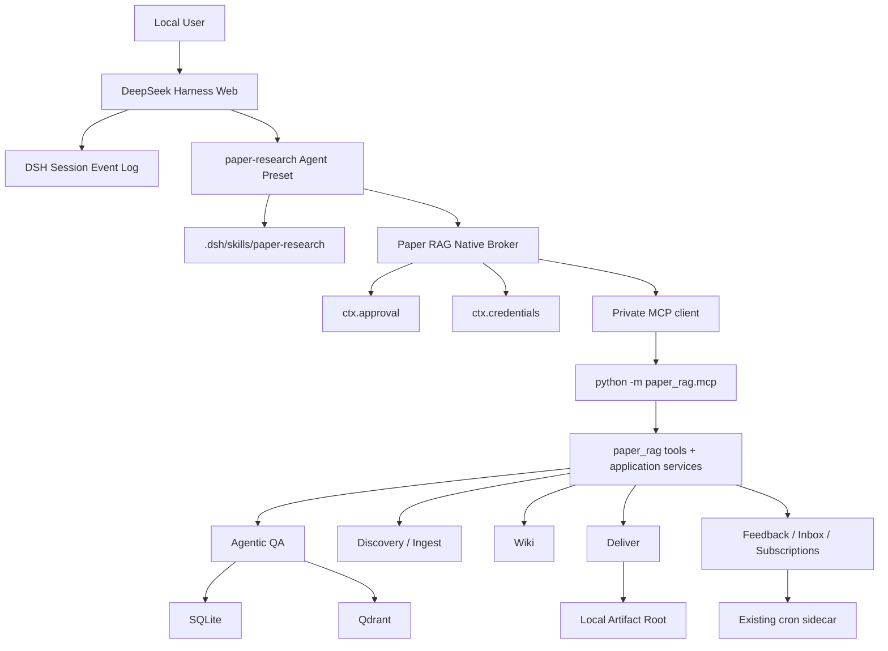

# SDD：DeepSeek Harness Runtime Migration

## 1. 技术上下文

- Python：3.10–3.12
- Domain Core：Pydantic、SQLModel、SQLite、Qdrant、OpenAI-compatible LLM
- 新 Agent Runtime：DeepSeek Harness Developer Preview
- 新协议边界：MCP over stdio
- 新产品形态：本地 loopback Web、单用户、Chat-first
- 旧宿主：`integrations/deer-flow/`
- 当前 DSH 候选版本：`0.1.0-rc.6`；最终锁定值由 G0 spike 产生

## 2. Constitution Check

| 规则 | 设计 |
|---|---|
| Domain Core 不依赖宿主 | `src/paper_rag/` 不导入 DeepSeek Harness、Cordis 或 DSH UI |
| 一份业务逻辑 | MCP 只调用 `paper_rag.tools`/application services，不复制 retrieval/abstain/citation |
| 证据优先 | final paper claims 只来自当前检索 chunks |
| 写操作可审计 | Broker executor 直接调用一次性 Approval + Paper RAG operation receipt/trace |
| 预览依赖可替换 | DSH 代码封装在 `integrations/deepseek-harness/` |
| 迁移可回滚 | G5 前不删除 DeerFlow，不迁移 Paper RAG 主数据 |
| 默认最小权限 | 领域 Preset 不继承 Coding Agent 的 Bash/FS/Code/Ralph |

无需要豁免的规则。

## 3. 架构

### 3.1 目标架构



### 3.2 两层 Loop

外层 DSH：

```text
理解用户目标
-> 选择 Paper RAG 工具
-> 请求写操作确认
-> 组织少量跨论文调用
-> 呈现结果和产物
```

内层 Paper RAG：

```text
resolve query
-> retrieve
-> rerank
-> bounded reflect
-> abstain
-> evidence select
-> generate
-> citation validate
```

外层不得拆开或重排内层证据链。

## 4. 代码布局

```text
paper-rag-agent/
├── .dsh/
│   └── skills/
│       └── paper-research/
│           └── SKILL.md
├── integrations/
│   ├── deer-flow/                         # G5 前保留
│   └── deepseek-harness/
│       ├── README.md
│       ├── package.json                   # exact DSH packages + compatible Cordis
│       ├── pnpm-lock.yaml
│       ├── cordis.patch.yml               # default preset + Broker bundle
│       ├── presets/
│       │   └── paper-research/
│       │       ├── agent.cordis.yml
│       │       └── preset.yml
│       ├── src/
│       │   ├── broker.ts                  # native tools + private MCP lifecycle
│       │   ├── credentials.ts             # ctx.credentials -> child env
│       │   ├── approvals.ts               # direct one-shot approval
│       │   ├── operation-guard.ts         # per-turn fingerprint + operation id
│       │   ├── session-context.ts         # hidden agent/session metadata
│       │   ├── projection.ts              # model-visible bounded text
│       │   └── presentation.ts            # G2+ Tool Card projections
│       ├── scripts/
│       │   ├── bootstrap.mjs
│       │   ├── sync-preset.mjs
│       │   ├── start.mjs
│       │   ├── doctor.mjs
│       │   └── smoke.mjs
│       └── tests/
│           ├── composition.spec.ts
│           ├── broker.spec.ts
│           ├── approval.spec.ts
│           ├── credentials.spec.ts
│           ├── session-context.spec.ts
│           └── behavior.spec.ts
├── src/paper_rag/
│   ├── mcp/
│   │   ├── __init__.py
│   │   ├── __main__.py
│   │   ├── server.py
│   │   ├── registry.py
│   │   ├── context.py
│   │   ├── errors.py
│   │   ├── operations.py                  # persistent write receipts
│   │   ├── artifacts.py
│   │   └── presenters.py
│   └── tools/
│       ├── paper_library.py               # framework-neutral list/status
│       └── ...                            # existing facades
├── tests/
│   ├── test_mcp_contract.py
│   ├── test_mcp_tools.py
│   ├── test_mcp_security.py
│   ├── test_mcp_artifacts.py
│   └── test_dsh_parity.py
└── specs/20260813-deepseek-harness-migration/
```

### 4.1 为什么 MCP 放在 `src`

`paper_rag.mcp` 是通用协议适配，可被 DSH、Codex、Claude Code 或其他 MCP Client
复用；它不应放入 DSH 专属目录。

### 4.2 为什么 Preset 源放在 integration

DSH 当前从 shipped root 和 `$DSH_HOME/.agent-presets` 发现 Preset。仓库保存权威 Preset
源，`sync-preset.mjs` 幂等复制到 repo-local `DSH_HOME`。运行目录被忽略，不成为第二份
真相源。

## 5. 组件设计

### 5.1 `paper_rag.mcp`

职责：

1. 注册 MCP Tool。
2. 将 MCP 参数转成现有 Pydantic 输入。
3. 从可信 ServerConfig/RequestContext 注入 `actor_id`，并在调用既有 API 时映射到
   `user_id` 参数。
4. 调用现有 Python facade。
5. 返回 lossless canonical result；模型 text projection 由 Broker 负责。
6. 将异常映射为稳定错误。
7. 管理 deliverable artifact。

禁止：

- 不做 Agent 工具选择。
- 不自行检索、rerank、abstain 或校验 citation。
- 不读取 DSH Session 文件。
- 不信任模型传入的 `user_id/actor_id`、artifact root 或数据路径。

### 5.2 Paper RAG Native Broker

产品路径不直接挂载 `@deepseek-ai/dsh-mcp-client`。Broker 自己持有一个私有 MCP Client，
但只把审核过的 native `ToolDefinition` 注册到当前 preset scope。

Broker 静态依赖：

```text
tools
approval
credentials
subprocess or private MCP transport
```

启动事务：

1. 验证运行在 `paper-research` standing preset mount，而不是 root realm。
2. 解析 exact toolset 和 native tool definitions。
3. 对每个 allowlisted name 调用
   `ctx.credentials.describe(credentialRef(name))` 检查是否已配置。
4. 启动私有 Python MCP child 并完成 tool/schema handshake。
5. 验证 raw MCP tool/schema 与 Broker 期待完全一致。
6. 注册 native tools。
7. 注册同步 `agent/created` listener：对每个加入该 Preset 的
   `agent.ctx.tools.restrict({allow: INHERITED_GLOBAL_ALLOW})` 应用 inherited global
   allowlist。listener
   失败会 veto Agent publication。
8. 注册 `agent/pre-step` invariant：读取该 Agent 完整可见 tool schema 集合，必须与
   `FINAL_MODEL_CATALOG` 的 name + input schema hash 完全相等；HMR、同 scope 新注册或
   restriction 丢失造成任何
   extra/missing tool 时 reject step，不发送模型请求。

任一步失败则整个 Broker activation 失败，零 Paper RAG tools 注册。HMR/dispose 先撤销
native registrations，再取消 in-flight call，关闭 MCP child，最后释放 credential generation。

Broker、私有 MCP child、native registrations 和 credential generation 的 owner 是
**standing preset generation**，不是单 Agent：

- 同一 standing generation 的多个 Agent 共用一个 Broker child。
- Agent dispose 只释放自己的 restriction/boundary state，不关闭仍被 generation 使用的
  child。
- Preset 文件变化产生新 standing generation；新 Agent 使用新 generation，既有 Agent
  继续使用旧 generation。
- superseded generation 在最后一个关联 Agent 释放前不得关闭 child；如果上游 standing
  mount 当前只在 Host teardown 回收，Broker 必须接受该 bounded-by-edits 生命周期并暴露
  generation 数量诊断。
- Host shutdown 关闭所有 generation，等待 in-flight call 有界收敛。

只读 native executor：

```text
validate model args
-> attach hidden actor/session/call metadata
-> private MCP call
-> validate canonical result
-> produce bounded model text + UI presentation
```

写 native executor：

```text
validate model args
-> compute canonical fingerprint
-> deny same-turn duplicate unless direct user re-run
-> ctx.approval.request({
     agent: exec.agent,
     toolName: exec.name,
     callId: exec.callId,
     reason,
     signal: exec.signal,
   })
-> require allowed-once
-> derive durable direct-human request_boundary_id
-> create hidden operation_id from session + request boundary + tool + args hash
-> private MCP call with operation_id
-> persist/read operation receipt
-> project bounded result
```

没有 Agent、没有 open turn、没有 Approval Service、审批结果不是 `allowed-once`，都不得
调用 Python handler。直接运行 `python -m paper_rag.mcp` 属于可信 operator/debug 边界，
不经过 DSH 审批，不能作为产品写入口。

### 5.3 Credential Bridge

Paper RAG 使用以下 references：

```text
OPENAI_API_KEY
VISION_API_KEY      # 仅 vision 启用时
```

非 secret 配置如 `OPENAI_BASE_URL`、`CHAT_MODEL`、`VISION_BASE_URL`、`VISION_MODEL`
来自受控配置或显式 non-secret env。未来 source 如需额外 secret，必须先在 Broker 的
credential reference allowlist 和 G0 credential tests 中登记，不能读取任意环境变量。

Broker 在每个 child generation 启动前，对每个 allowlisted reference 调用
`ctx.credentials.resolve(credentialRef(name))` 解析所需 secret，只把值放入 stdio child
的显式 env。禁止：

- 把 secret 写入 `cordis.patch.yml`、preset、settings 或 command args；
- 输出包含值的 log/error；
- 在 `--dump-config`、Session Event、tool result、Gate report 中持久化；
- 把 `.credentials.yaml` 的 `0600` 描述成对同 UID Agent 的安全边界。

`0700/0600` 只防其他 OS 用户。真正的模型侧防护来自 exact tool allowlist：Preset 不提供
Bash、FS、Code 等能读取同 UID credential 文件的能力。

Credential 更新时不在旧 child 上原地修改 env；Broker 启动新 generation、完成 handshake，
再原子替换并关闭旧 generation。更新失败保留上一可用 generation并报警。

### 5.4 DSH Paper Research Preset

Preset 只挂载：

- Paper Research persona。
- project Skill discovery。
- `tool-skill`。
- `tool-ask-user`。
- context compaction。
- Paper RAG Native Broker。

Host 静态 composition 必须激活 `@deepseek-ai/dsh-tool-call-timeout-policy`。它不是
model-visible tool，不进入 `FINAL_MODEL_CATALOG`；它负责执行 Broker ToolDefinition 的
`timeoutMs`。doctor、`dsh-dump-config` 和 G0 compatibility runner 都必须断言该 plugin
active；缺失时 Broker activation/doctor fail closed。

默认不挂载：

- `tool-bash` / `tool-pwsh`
- `tool-fs` / `str_replace_editor`
- Code Mode
- Jobs
- Workflow
- Ralph
- generic subagent
- `web_fetch`

必须定义两个不同常量：

```text
INHERITED_GLOBAL_ALLOW = []
FINAL_MODEL_CATALOG = [
  skill,
  ask_user_question,
  paper_status,
  paper_list,
  paper_search,
  paper_qa,
  paper_section,
  paper_compare,
  wiki_lookup,
]
```

`INHERITED_GLOBAL_ALLOW` 只传给 `agent.ctx.tools.restrict()`，只能包含真实 global tools；
G1 不允许任何 global model tool，因此是空数组。Preset-local `skill`、`ask_user_question`
和 Broker native tools 绝不能传给 `restrict()`，因为 scoped registrations会在
restriction 后合并，且 `restrict()` 会拒绝 scope-local/unknown names。

`FINAL_MODEL_CATALOG` 只用于 `agent/pre-step` 完整目录和 schema hash invariant。G1
精确集合是：

```text
skill
ask_user_question
paper_status
paper_list
paper_search
paper_qa
paper_section
paper_compare
wiki_lookup
```

测试比较完整集合，任何额外全局工具都失败，特别是 `web_search`、`web_fetch`、Bash、
FS、Code、Workflow、Ralph、Goal、Todo 和 Subagent。G2 如评审后启用 `web_search`，
必须修改 allowlist 和行为评测，并声明：

```text
Web/discovery content is candidate context only.
Final paper claims require indexed paper_rag chunks.
```

### 5.5 DSH Profile 与运行目录

仓库内使用 repo-local Harness home：

```text
data/runtime/deepseek-harness/
├── credentials/
│   └── .credentials.yaml                 # stable provider, 0600
└── versions/
    └── <exact-dsh-version>/
        ├── profiles/
        ├── .agent-presets/
        ├── sessions/
        └── settings.yaml
```

这里的 repo root 必须通过 `git rev-parse --show-toplevel`、调用方显式参数或经过验证的
脚本位置推导，不能直接使用启动时 `process.cwd()`。无法定位包含 `src/paper_rag` 和本
spec 的 Git root 时 fail closed。

该目录加入 `.gitignore`。`bootstrap.mjs`：

1. 验证 Node/OS/架构。
2. 安装 exact-pinned npm dependencies。
3. 初始化 Web profile。
4. 同步 `paper-research` Preset。
5. 写最小 profile patch，不覆盖用户 credential。
6. 输出 `--dump-config` 摘要。

profile patch 必须把 `credentials-local.path` 显式设置为：

```text
<repo>/data/runtime/deepseek-harness/credentials/.credentials.yaml
```

因此 credential provider 不随 versioned `DSH_HOME` 切换。doctor 检查 credential 目录
0700、文件 0600，并明确提示：该权限只防其他 OS 用户，不防同 UID 进程。

`start.mjs` 设置：

```text
DSH_HOME=<repo>/data/runtime/deepseek-harness/versions/<exact-dsh-version>
DSH_TELEMETRY_DISABLED=1
DSH_TOOLS_MODE=native
DSH_PERMISSION_MODE=read-only
PAPER_RAG_BROKER_TOOLSET=<readonly|research|full>
PAPER_RAG_ACTOR_ID=system
PAPER_RAG_ARTIFACT_ROOT=<repo>/data/artifacts
PAPER_RAG_IMPORT_ROOT=<repo>/data/imports
```

`read-only` 只限制 DSH 文件工具。产品写权限由 Broker executor 内的一次性 Approval
和 Python Server validation 共同控制。toolset 是 child/Broker startup-time contract；
降级后必须重启 Broker generation/Host 并重新验证完整 tool catalog。

## 6. MCP 公共契约

### 6.1 Tool Result Envelope

所有 Tool 返回：

```json
{
  "ok": true,
  "tool": "paper_qa",
  "trace_id": "optional",
  "data": {},
  "warnings": [],
  "evidence_role": "indexed_chunks|discovery_only|metadata|artifact|none"
}
```

领域错误使用成功 MCP transport 下的 canonical result：

```json
{
  "ok": false,
  "tool": "paper_qa",
  "error": {
    "code": "VALIDATION|NOT_FOUND|CONFLICT|UNAVAILABLE|TIMEOUT|CANCELLED|INTERNAL",
    "message": "safe user-facing message",
    "retryable": false,
    "details": {}
  }
}
```

`details` 不含 API key、完整 PDF 内容、绝对数据库连接信息或 Python traceback。
Broker 的模型 text 必须以稳定 `[CODE]` 开头，并包含继续决策所需的最小字段。只有
MCP framing、child crash、schema mismatch 等 transport failure 才抛出
`[MCP_UNAVAILABLE]`，且不得被误报成领域 NOT_FOUND/VALIDATION。

### 6.2 Toolset 分层

Broker 通过私有 child env 设置 `PAPER_RAG_MCP_TOOLSET`；该变量不由模型控制。Server
按它注册 raw tools：

| Toolset | 工具 |
|---|---|
| `readonly` | status/list/search/qa/section/compare/wiki lookup |
| `research` | readonly + discover/run get/ingest/candidate ingest/wiki generate/export/deliver |
| `full` | research + subscription/inbox/feedback/digest/stale |

默认 `readonly`，每个 Gate 显式提升。

raw names 只用于 Broker handshake：

```text
MCP raw name: paper_qa
DSH native/model name: paper_qa
```

`mcp__paper_rag__*` names 不得出现在产品模型目录。G0 可用官方通用 MCP Client 做
fixture 对照，但不能把其 namespaced tools 带进 Paper Research Preset。

### 6.3 关键 Schema

`paper_qa`：

```json
{
  "question": "self-contained research question",
  "paper_ids": ["optional hard constraints"],
  "resolved_question": "optional explicit self-contained resolution"
}
```

不暴露：

```text
user_id
conversation_id
memory_mode
context_source
```

`paper_ingest`：

```json
{
  "source": {
    "arxiv_id": "optional",
    "pdf_url": "optional",
    "pdf_path": "optional path below import root"
  },
  "title_hint": "optional",
  "force": false
}
```

三种 source 必须 exact-one。

`paper_compare`：

```json
{
  "paper_ids": ["1..4"],
  "dimensions": ["1..4"]
}
```

现有 `paper_compare()` 内部调用 `answer()` 时没有传 `user_id`，会落到 `system`。迁移时必须
把可信 `McpRequestContext.actor_id` 映射到 compare 的每个 QA 子调用；该字段仍不进入
model-visible Schema。其他 fan-out 工具也必须接受同一可信 context，不能各自硬编码
`"tool"`、`"system"` 或其他身份。

`paper_deliver`：

```json
{
  "format": "markdown_survey|pptx|docx|latex_bib|pdf",
  "paper_ids": ["1..8"],
  "title": "optional",
  "options": {}
}
```

### 6.4 当前 Python Facade 的收敛

以下逻辑当前困在 DeerFlow Router 内，迁移时提取为 framework-neutral application
services：

- runtime status
- visible paper list
- knowledge build status（若 Chat-first 需要）
- wiki generate
- deliver artifact persistence

FastAPI/Pydantic response model、HTTP status 和 SSE 逻辑不进入新 service。

## 7. 身份与会话

### 7.1 Actor 与 Shared Corpus

本地版只有一个可信 actor：

```text
actor_id = PAPER_RAG_ACTOR_ID = "system"
```

默认 `system` 是为了兼容现有单用户数据和 Python API 默认值。部署可以显式改成一个
固定 local actor，但仍然只能有一个，不从模型参数或 Web 用户输入读取。

Actor 用于：

- conversation/research memory；
- discovery run owner；
- feedback；
- subscriptions/inbox/paper access；
- audit/trace attribution。

论文库是 shared corpus。当前 retrieval/Qdrant filter 不按 user id 隔离，`Paper.user_id`
也没有形成完整的 ingest→retrieval 权威链。因此本 SDD 不设计或承诺多租户语料隔离，
也不要求 `system + local` 合并读取。真正的 tenant-scoped corpus 必须单独设计：

- ingest owner 持久化；
- SQLite paper/chunk ownership；
- Qdrant user payload；
- dense/sparse/section/BibTeX/deliver 全路径 filter；
- 历史数据迁移和共享语料语义。

模型不能覆盖 actor。

### 7.2 G1 会话策略：Broker 身份、DSH 解析权威

Broker 从 `exec.agent.id` 取得可信 `conversation_id`，但不把它加入模型 Schema。
每次 `paper_qa` 调用都规范化为：

```text
DSH Session history
-> Agent 将 follow-up 变成 self-contained question
-> Broker effective = resolved_question || question
-> private MCP:
     question = question
     resolved_question = effective
     conversation_id = exec.agent.id
```

要求：

- Skill 明确要求传 self-contained question。
- 即使模型省略 `resolved_question`，Broker 也把 `question` 同时作为 outer resolution。
- Python 使用 `authoritative_outer`，不执行 history/research-memory fallback rewrite。
- Research memory 可以持久化和提供 scope hint，但不是 rewrite authority 或证据。
- `query_resolution.source` 为 api/DSH outer equivalent，不得出现第二次改写。

私有 metadata：

```json
{
  "paper_rag": {
    "conversation_id": "<DSH SessionId>",
    "actor_id": "system",
    "caller": "deepseek_harness",
    "request_boundary_id": "<durable direct-human request boundary>",
    "tool_call_id": "<DSH CallId>",
    "operation_id": "<write only>"
  }
}
```

wire contract 固定为 MCP `tools/call.params._meta.paper_rag`。Broker 自己构造 request，
Python Server 从 SDK request context 读取该 `_meta`；raw inputSchema、模型 arguments、
Session tool/call 和 tool/result 均不包含该 metadata。G0 必须端到端验证 TS 发送和 Python
接收。目标 SDK 无法保留该 loose `_meta` 时 G0 失败，不降级为 wrapper arguments 或
model-visible `conversation_id`。

### 7.3 Direct-Human Request Boundary

Broker 在 agent-scoped state 中保存当前 `request_boundary_id`。唯一算法：

1. 在每次 `agent/pre-step` 查看 claimed `messages[]`，仅选择
   `message.source.kind === "user"` 的 direct-user messages。
2. 按 claimed 顺序取它们稳定的 `message.id`。
3. 如果本批有一个或多个 direct-user messages：

```text
request_boundary_id = UUIDv5(
  fixed_namespace,
  session_id + "\0" + message_ids.join("\0")
)
```

并替换当前 boundary。一个批次内多个 human messages 共同构成一个 boundary。
4. 如果本批只有 plugin/goal/cron/skill/compaction 等 synthetic messages，则继承当前
   boundary，不创建新 boundary。
5. `source.kind="user"` 的 next-step steering 属于新的 direct-user batch，因此生成新
   boundary；ordinary user follow-up 同理。
6. Agent 创建/resume 时 boundary 初始为空。恢复历史 Session 不从旧消息猜测 active
   boundary；只有新的 direct-user message 才建立新 boundary。
7. 当前 boundary 为空时，所有写工具在 Approval 前返回
   `DIRECT_USER_AUTHORITY_REQUIRED`；只读工具仍可执行。
8. `agent/turn-stopping` 不清空 boundary，使同一个 human request 驱动的 later step 继续
   复用；下一批 direct-user message 才替换。

Broker 把 boundary 注入 `_meta.paper_rag.request_boundary_id`；Python operation receipt
不自行推断消息或 turn。

### 7.4 Session 与数据的关系

- DSH Session Log：对话、工具轨迹、计划和 UI 回放。
- Paper RAG conversation store：可选领域摘要，不是证据。
- SQLite/Qdrant：论文和知识数据真值。
- 删除 DSH Session 不删除论文数据。
- 删除论文数据不重写历史 Session，只让后续工具返回 not found/stale。

### 7.5 Session 版本分代与升级

- 每个 exact DSH version 使用独立 `versions/<version>/sessions`。
- credential 文件独立存放，不复制进各版本 Session root。
- 升级前冻结旧 lockfile、binary/package archive 和只读 Session 备份。
- Upgrade Gate 必须加载真实上一版本完整 Session fixture，验证 read/resume；若上游格式
  不兼容，则明确采用“旧 Session 只由旧版本继续读取，新版本从新 Session 开始”。
- 新版本不得原地写旧版本唯一 Session root。
- 回退恢复旧 lockfile/binary/root；不要求旧 binary 读取新 Session。

## 8. 权限设计

### 8.1 Tool Classification

| 分类 | 工具 | 决策 |
|---|---|---|
| Read | status/list/search/qa/section/compare/wiki/inbox/subscription list | allow |
| Candidate network read | discover | allow，结果标记非证据 |
| Expensive/local write | ingest/candidate ingest/wiki generate/deliver/digest/stale | ask |
| Reversible state write | subscription add/toggle/delete | ask |
| Low-risk interaction write | feedback/inbox read/dismiss | allow only after direct user request；否则 deny |
| Unsupported | arbitrary shell/fs/fetch | 不注册或 deny |

### 8.2 Approval Message

审批必须说明：

- 工具名。
- 将修改的资源。
- 论文数量/格式。
- 预计网络和模型调用。
- artifact 输出目录。
- force/re-ingest 风险。

例：

```text
将下载并入库 3 篇候选论文，写入 SQLite/Qdrant，并可能调用解析、embedding 和 Wiki。
允许本次执行吗？
```

### 8.3 Defense in Depth

Broker 内部 Approval 是产品授权边界；Python Server 不声称能验证 DSH 用户审批。它仍
负责领域和协议边界：

- toolset 是否启用。
- exact-one source。
- paper/dimension/count limits。
- local import root。
- artifact root。
- fixed actor identity。
- force 是否显式。
- 写工具是否带 Broker 生成的 `operation_id`。
- operation receipt 是否已存在、成功、失败或 outcome unknown。

Broker 不激活时，模型没有任何 Paper RAG tool。直接运行 Python MCP 是可信 operator
debug 能力；是否开放 raw write tool 由 operator 的 toolset 配置决定，不能计入产品审批
证明。

## 9. Artifact 设计

### 9.1 Layout

```text
data/artifacts/
└── <artifact_id>/
    ├── manifest.json
    └── <sanitized_filename>
```

`artifact_id` 使用随机 UUID，不由模型指定。

### 9.2 Manifest

```json
{
  "artifact_id": "...",
  "format": "pptx",
  "filename": "...",
  "content_type": "...",
  "size_bytes": 123,
  "sha256": "...",
  "source_paper_ids": [],
  "abstained_paper_ids": [],
  "created_at": "...",
  "trace_id": "..."
}
```

### 9.3 返回

MCP 返回 manifest 摘要和本地 locator，不返回 `content_base64`。G2+ 可开发 DSH
deliverable card；该 UI 只读取 result metadata，不重新读取业务数据库。

### 9.4 清理

- 默认保留 30 天。
- 提供独立 CLI 清理，按 manifest 时间执行。
- 清理不删除源论文、chunks、Wiki 或 Session。
- 当前 Session 引用已清理 artifact 时显示 unavailable，不自动重建。

## 10. 长任务、超时与取消

### 10.1 超时

| 类型 | 建议上限 |
|---|---|
| status/list/search/section/wiki read | 60s |
| QA | 180s |
| compare | 600s |
| discover | 180s |
| ingest/wiki generate/deliver | 900s |

私有 MCP transport 使用 900s outer cap。Broker 的 native `ToolDefinition.timeoutMs` 按
上表设置，并把绝对 monotonic deadline 隐藏传给 Python。Python handler 必须真正执行：

- 进入每个 pipeline stage 前检查 remaining budget；
- HTTP/LLM 调用使用 remaining timeout；
- parse 使用现有进程 timeout；
- deadline 后不再开始新 stage，并将 receipt 标为 cancelled/failed/unknown；
- 对无法硬停的同步 embedding/本地库调用，等待当前 stage 的组件上限后安全收敛，不能
  宣称已即时取消。

### 10.2 取消

- 只读工具：取消后不产生持久副作用。
- ingest：底层已有阶段状态机；若 cancellation 无法终止正在运行的同步线程，允许其
  完成当前安全阶段并最终收敛到 `done` 或 `failed`。
- deliver：只在完整文件写完后原子 rename；取消留下的临时文件由 cleanup 删除。
- 写操作 receipt 是本 spec 的必需持久状态；不新增通用后台 job 调度器。

### 10.3 重试

- 只读调用可按 error.retryable 重试一次。
- Broker 在同一 direct-human request boundary 维护 `(tool, canonical_args_sha256)`，即使
  模型生成新 call id，第二次相同写调用也确定性 deny。
- 用户新消息明确要求重新执行时，先核对最近相同 fingerprint receipt；若为
  outcome_unknown，审批必须说明重复副作用风险。批准后新 request boundary 生成新
  operation id。
- Python 在 handler 前原子插入 operation receipt；同 operation id 返回 cached result，或
  对 running/unknown 返回 `OPERATION_OUTCOME_UNKNOWN`，绝不盲目重做。
- ingest 继续依靠现有 dedup/force/state machine；deliver 以 operation id 绑定 artifact。
- subscription/feedback 等已有唯一约束或 dedup 仍保留，但不能替代 operation receipt。

## 11. Prompt 与 Skill

Skill 是 Agent 行为的权威规则，包含：

1. 默认使用 `paper_qa` 回答论文内容。
2. Follow-up 必须先解析成 self-contained question。
3. `paper_qa.abstain` 权威。
4. Discovery/Web/Session memory 不是 final evidence。
5. 入库前展示候选，写操作走 approval。
6. Compare 最多 4 × 4。
7. Deliver 前复述格式、论文范围和标题。
8. 输出先给直接回答，再给来源/限制。
9. 不显示不存在的 citation。
10. Tool error 时报告真实状态，不自行宣称成功。

Persona 保持短，领域规则放 Skill，避免每轮固定 Prompt 过大。

## 12. Proactive 能力

现有 APScheduler sidecar 保留，不迁到 DSH Goal/Ralph：

```text
paper_rag.proactive.cron_runner
-> digest/stale
-> inbox SQLite
-> DSH 工具按需读取
```

原因：

- cron 是确定性后台调度，不需要模型常驻。
- DSH Web 本地进程可能关闭。
- Goal/Ralph 不适合作为可靠 cron。

G3 只新增 Chat-first CRUD 工具，不改变调度数据模型。

## 13. Observability

### 13.1 默认

- `DSH_TELEMETRY_DISABLED=1`。
- 保留本地 Session JSONL。
- Paper RAG 继续输出现有 metrics/trace。
- MCP 每次调用记录：
  - tool
  - duration
  - outcome/error code
  - trace_id
  - counts，不记录完整论文正文。

### 13.2 关联

```text
DSH session id
-> DSH tool call id
-> MCP tool name
-> Paper RAG trace_id
```

Broker 从 G1 起隐藏透传 session/call id；Python 日志可以记录这些非 secret correlation
id 和 Paper RAG trace id，但不能记录完整 prompt、chunk body 或 credential。

### 13.3 Secret/PII

- API key 只由 Broker 通过 `ctx.credentials` 解析并显式注入私有 child generation。
- 不写入 Cordis ordinary headers。
- credential 文件权限只防其他 OS 用户，不是对同 UID Agent 的边界。
- Session full telemetry 默认关闭。
- Tool error 不回显环境变量和 traceback。
- Feedback 继续沿用当前脱敏逻辑。

## 14. 依赖与版本策略

### 14.1 Node

`integrations/deepseek-harness/package.json` exact-pin：

- `@deepseek-ai/dsh`
- 直接 import 的 `@deepseek-ai/dsh-*`
- `@deepseek-ai/cordis`
- test/build 工具

所有直接 `@deepseek-ai/dsh*` 使用同一个 exact DSH version。Cordis 和其他 vendor 包
使用该 DSH 发布 dependency/peer graph 验证过的 exact compatible version，不要求版本
号文字相同。禁止 `^`、`~` 和 `latest`，lockfile 中只能解析出一个 Cordis 实例且 peer
requirements 全满足。

### 14.2 Python

新增 optional extra：

```text
harness = [official MCP Python SDK pinned by G0]
```

G0 在当前 Python 3.10/3.11/3.12 CI 上验证后再写具体版本。Core base dependencies 不强制
安装 MCP。

### 14.3 Upgrade

每次 DSH RC 升级：

1. 新分支更新 exact versions。
2. `--dump-config` diff。
3. TypeScript contract tests。
4. MCP smoke。
5. 上一 exact 版本 Session fixture + 分代 root 回退演练。
6. Broker approval/credential/HMR test。
7. credential provider path 和 exact tool catalog audit。
8. 通过后合并，不做运行时自动更新。

## 15. 启动与命令

新增 Make targets：

```text
dsh-install       安装并同步 profile/preset
dsh-doctor        环境和依赖检查
dsh-start         启动本地 Web
dsh-smoke         无外部副作用 smoke
dsh-test          MCP + DSH deterministic tests
dsh-clean-runtime 删除可重建的 DSH runtime，不删除 Paper RAG data
```

`dsh-clean-runtime` 默认只删指定 `versions/<version>`，不得删除
`data/runtime/deepseek-harness/credentials/`。删除 credential 需要独立显式命令。

默认开发流：

```bash
make install-dev
make dsh-install
make qdrant-up
make init-store
make dsh-doctor
make dsh-start
```

## 16. CI

### 16.1 Core Matrix

保留 Python 3.10/3.11/3.12 核心测试，不要求 Node。

### 16.2 MCP Matrix

- 安装 `.[dev,harness]`。
- MCP tool list contract。
- 工具输入/输出/error/security/artifact tests。
- operation receipt migration/idempotency/crash recovery tests。
- 不发真实模型/网络请求。

### 16.3 DSH Job

- Node 版本满足 DSH 要求。
- `pnpm install --frozen-lockfile`。
- TypeScript lint/typecheck/test。
- `dsh --dump-config`。
- 用 scripted/replay model 跑行为 fixture。
- 启动真实最小 Host/Web/Preset/Native Broker/stdio MCP fixture。
- 验证 credential bridge、exact catalog、approval、reconnect、session resume 和 cancel。

### 16.4 质量门禁环境

G0 先创建 migration-owned Python 环境，不复用 DeerFlow backend venv。以下命令必须改为
使用 `$(PY)` 或显式 migration venv：

```text
eval-golden
eval-golden-qa
eval-citation-audit
eval-claims
verify-p0
```

G0 冻结 baseline manifest，记录：

```text
command
dataset sha256
gate file sha256
collected/passed/skipped counts
skip ids and reasons
aggregate metrics
generated report sha256
commit
config path
```

后续 Gate 不允许测试数减少、新增 skip 或指标低于已有 gate，除非规格中有明确批准。

### 16.5 Gate Runner 与报告

新增命令：

```text
.venv/bin/python scripts/migration_gate.py run-gate --gate Gx --manifest ... --report ...
.venv/bin/python scripts/migration_gate.py validate-report --gate Gx --report ...
.venv/bin/python scripts/migration_gate.py run-live --case LIVE-xxx --config ...
.venv/bin/python scripts/migration_gate.py validate-live --gate Gx
.venv/bin/python scripts/migration_gate.py validate-cutover
bash scripts/deepseek_harness_clean_checkout_gate.sh
pnpm g0:compat --report <component-report>
```

`run-gate` 是唯一 Gate orchestrator：读取 machine manifest 中该 Gate 的 component commands，
按顺序执行并捕获 exit code/stdout-stderr locator，执行所有 required case runner，收集
live/quality/capability artifacts，最后原子写最终 Gate report。`validate-report` 不执行
测试，只作为最后一步只读验证最终报告。

orchestrator 在任何 component 前验证 `HEAD` 已提交且工作区 clean；dirty/untracked 直接
失败。因此 SPEC/SDD/SDT 必须先完成评审、批准并提交，正式 G0 才能开始。规格编写阶段的
未跟踪 `specs/` 和 `docs/README.md` 修改属于进入 Gate 前的流程状态，不作为架构缺陷。

所有 Python 命令使用 `.venv/bin/python` 或显式 `MIGRATION_PY`；禁止裸 `python`，也不
允许回退到 `DEERFLOW_BACKEND_PY`。Ruff 也通过 `.venv/bin/python -m ruff` 执行，并在
migration dependency lock 中固定版本。

component artifacts 与最终 Gate report 使用不同路径：

```text
data/index/migration-gates/components/<gate>/<component>.json
data/index/migration-gates/<gate>.json
```

例如 `dsh-g0-compat` 只写 `components/G0/dsh-g0-compat.json`；orchestrator 验证并聚合
component 后，独占原子写最终 `G0.json`。

Gate required cases 是累计合同。machine manifest 的 `inherits_required_cases` 表达：

```text
G1 <- G0
G2 <- G0,G1
G3 <- G0,G1,G2
G4 <- G0,G1,G2,G3
G5 <- G0,G1,G2,G3,G4
```

`run-gate` 对当前 commit 重新产生本 Gate 和全部继承 Gate 的非历史 case 状态；不能只
复用旧报告。G4 component commands 必须包含 clean checkout rehearsal；G5 再运行一次
clean checkout。

Gate report 是版本化 JSON，至少包含：

```text
schema_version
gate
commit
dirty=false
DSH/Cordis/Python/Node exact versions
config and dataset fingerprints
case id -> PASS/FAIL/BLOCKED/NOT_RUN/NOT_APPLICABLE
command + exit code + started/finished
live authorization + actor + data root + expiry
known gaps
go/no-go
```

validator 在以下情况失败：报告缺失、commit 不匹配、dirty、版本或 config 不匹配、累计
required case 非 PASS、授权缺失、live 报告过期、数据 root 未隔离、命令退出码非 0。

G0 要求 `DSH-G0-001..009` 全部 PASS，不允许 P1 延后。`dsh-smoke` 和
`dsh-g0-compat`、secret scan 和 diff check 都是 G0 component commands；orchestrator
在它们全部结束后才写 G0 report，validator 永远是独立最后一步。

`diff-check` 不能在 clean workspace 上运行无参数 `git diff --check`。orchestrator 为每个
Gate 决定并记录 `MIGRATION_GATE_BASE`，component 执行：

```text
.venv/bin/python scripts/migration_gate.py diff-check \
  --base-env MIGRATION_GATE_BASE \
  --head HEAD
```

内部验证 `<base>...HEAD` 的完整 commit diff，并把 base/head 写入 Gate report。

### 16.6 Live Eval

不在普通 PR CI 中运行。G1/G2 手工或受控 workflow 执行：

- 现有 QA/eval set。
- DSH 真实模型。
- 指标报告和费用记录。

普通 LIVE-001..004 有 runner 和 report schema，绑定 exact commit、credential references、
授权人、隔离数据 root，默认 24 小时有效。普通 CI 不执行真实副作用，但
`validate-gate-report` 在缺少当前 commit 的有效 live report 时必须失败。

G4/G5 不继承观察窗口；它们在当前 commit 重新执行 DSH smoke、clean checkout 和非历史
quality/MCP/CUT 门禁。

### 16.7 DeerFlow Test Capability Migration

G0 对以下 65 个旧测试逐用例登记：

```text
host-specific-delete
capability-replaced-by-broker-or-mcp
still-required-and-moved
```

- Gateway router 的 status/QA/context/proactive 能力迁移到 application service、MCP 或
  Broker 测试。
- auth/rate-limit/general HTTP middleware 若 Chat-first 本地产品不再需要，可标
  `host-specific-delete`，但必须记录产品非目标依据。
- token/latency/recursion/PII 中仍适用于 DSH 的能力，必须由 Broker/DSH/observability
  测试替代；不能整文件删除后视为覆盖。
- G5 `validate-cutover` 要求每个旧测试都有分类和替代 evidence。

## 17. 迁移阶段

### Phase 0 / G0 · Compatibility Spike

交付：

- frozen quality baseline + 65-test capability matrix
- exact DSH version + exact compatible Cordis graph
- minimal Web profile
- custom Preset discovery
- Native Broker + private stdio MCP hello/status
- credential reference bridge and redaction proof
- exact tool catalog proof
- model-visible bounded result/error projection
- direct Approval proof, including missing/mis-scoped/HMR fail-closed
- same-version session resume and versioned-root proof
- cancellation/reconnect behavior report
- `dsh-g0-compat` and validated structured report

失败条件：

- 任一 `DSH-G0-001..009` 非 PASS。
- DSH 无法稳定加载 Preset/Broker/private MCP。
- credential 无法安全转发或出现在 dump/log/session。
- Approval 缺失或 scope 错误时写 handler 仍能执行。
- exact catalog 出现 Web/Bash/FS/Code 等额外工具。
- canonical result 无法可靠投影到模型真实可见 text。

失败时不改业务代码。

### Phase 1 / G1 · Read-only MVP

交付：

- Python MCP server
- status/list/search/qa/section/compare/wiki
- Skill/Persona
- deterministic parity tests
- no-evidence behavior eval
- local start/doctor/smoke
- migration-owned golden retrieval、QA/citation、claim、verify-p0 gates

DeerFlow 仍为默认入口。

### Phase 2 / G2 · Research Workflow

交付：

- discover/run get
- ingest/candidate ingest
- wiki generate
- BibTeX/deliver
- direct Broker approval
- persistent operation receipts
- artifact store
- path security
- limited Tool Cards
- isolated live YAML + doctor main-data refusal

通过后可以让早期用户优先使用 DSH。

### Phase 3 / G3 · Proactive and Feedback

交付：

- subscriptions CRUD
- inbox list/read/dismiss
- feedback
- digest/stale trigger
- cron independence tests

### Phase 4 / G4 · Default Cutover

交付：

- README/README_EN/Makefile/.env/CI 默认 DSH
- docs/ARCHITECTURE、SYSTEM_DESIGN、OPERATIONS 更新
- DeerFlow 标记 legacy fallback
- DSH 默认入口 cutover smoke 和 clean checkout report

G4 后禁止新增 DeerFlow-only 功能。

### Phase 5 / G5 · DeerFlow Removal

删除：

- `integrations/deer-flow/`
- DeerFlow smoke/helper tests
- FastAPI/SSE/LangChain 仅为 DeerFlow 存在的依赖
- DeerFlow Make targets
- 失效的 integration references

保留：

- 历史 ADR，并标注 superseded
- 业务数据和领域测试
- 必要的历史 changelog
- operation receipts

删除前必须通过：

- migration-owned retrieval/QA-citation/claim/P0 gates
- 65 个旧测试逐用例迁移矩阵 validator
- CUT-001..006
- current-commit live report validator
- clean checkout gate

## 18. 回滚

| 阶段 | 回滚 |
|---|---|
| G0 | 删除 spike/versioned runtime；保留 baseline report；无业务数据变化 |
| G1 | 停止 DSH，继续用 DeerFlow；MCP 代码可保留 disabled |
| G2 | 将 Broker toolset 降回 readonly，重启 Broker/Host 并验证 exact catalog；清理隔离 artifact |
| G3 | 将 Broker toolset 降回 research，重启 Broker/Host；cron 继续独立运行 |
| G4 | README/Makefile 默认切回 DeerFlow；保留各 DSH version root 供诊断 |
| G5 | 删除后通过 pre-removal tag 恢复旧宿主代码、旧 venv 与旧 Session root |

任何回滚都不回滚 SQLite/Qdrant；写入必须向后兼容或幂等。

## 19. 风险

| 风险 | 缓解 |
|---|---|
| DSH RC API 快速变化 | exact pin + versioned Session root + previous-version fixture |
| MCP 不透传 session/credential | Native Broker 隐藏注入 identity 和 explicit child env |
| 双重 memory rewrite | outer resolved question 权威；测试 query_resolution |
| 写操作绕过审批 | Broker executor 直接 Approval；缺服务/错 scope/HMR 时零注册或拒绝 |
| 本地 UI 被误当公网服务 | effective config + actual socket doctor gate |
| Broker 长调用无进度 UI | 首版接受 pending call；只为高频结果做 Tool Card |
| 取消后 ingest 继续 | per-stage deadline + receipt outcome + 状态机安全收敛 |
| Base64 撑爆 Session | artifact store + locator |
| 删除 DeerFlow 后漏能力 | 65-test 迁移矩阵 + quality/CUT/clean-checkout gates |
| 多 Agent 成本失控 | 默认禁用；后续固定深度/并发/论文数 |

## 20. 实施前审批

本 SDD 与 `test/case.md` / `test/test-manifest.json` 审核通过前，不开始业务实现。
批准时必须同时确认：

1. 本地单用户边界。
2. 首版不复制 Dashboard。
3. Native Broker + private MCP 边界。
4. 写工具直接 Approval、operation receipt 和 exact tool allowlist。
5. versioned Session root 与 credential bridge。
6. isolated live YAML、quality gate 和 G5 删除门禁。
